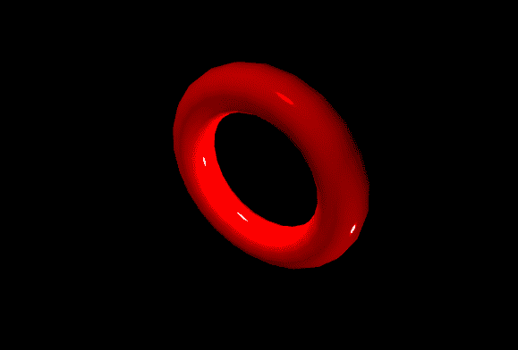

# 如何使用 p5.js 设计 Phong 着色图形？

> 原文:[https://www . geesforgeks . org/how-design-Phong-shading-graphics-use-P5-js/](https://www.geeksforgeeks.org/how-to-design-phong-shading-graphics-using-p5-js/)

**Phong 着色**是 3D 计算机图形学中的一种特定类型的着色技术，可用于平滑多表面形状、近似表面高光以及创建更复杂的计算机建模图像。专家称这种技术为“插值”，在这种技术中，Phong 着色使 3D 模型的表面更加平滑。Phong 模型对于学习更高级的渲染技术也非常有用。

Phong 底纹具有以下特点:

*   它能够产生出现在多边形中间的高光。
*   照明计算在每个像素执行。
*   法向量在多边形上插值。

**Phong Shading 算法:**Phong Shading 涉及三个不同的组件:

*   **环境光:**由于环境中所有的非定向环境光，该分量近似于来自表面的光。
*   **漫射:**该成分近似于光，最初来自光源，从漫射或无光泽的表面反射。
*   **镜面:**这个组件决定了物体的发光程度。

**单个光源**的完整 Phong 明暗模型为:

```
[ra,ga,ba] + [rd,gd,bd]max0(n•L) + [rs,gs,bs]max0(R•L)p
```

**多个光源**的型号为:

```
[ra,ga,ba] + Σi( [Lr,Lg,Lb] 
    ( [rd,gd,bd]max0(n•Li) + [rs,gs,bs]max0(R•Li)p ) )
```

**Phong 底纹视觉图解:**此处光线为白色，位置 *x=1，y =1，z=-1* 。环境光和漫射分量的颜色都是紫色的，镜面反射的颜色是白色的，它以窄高光反射一小部分照射到物体表面的光。漫射分量的强度随着表面的方向以及不同的光线位置而变化。环境分量被均匀着色。


**环境+漫射+镜面= PHONG 着色**

## java 描述语言

```
function setup() {
  createCanvas(640, 500, WEBGL);
}

function draw() {

  // Setting the vector values 
  // or the direction of light
  let dx = 300;
  let dy = 200;
  let dz = -600;
  let v = createVector(dx, dy, dz);

  // Creating the ambient light 
  ambientLight(0, 0,255);

  // Creating the directional light
  // by using the given vector
  directionalLight(255, 0, 0, v);

  shininess(255);
  specularColor(255);
  specularMaterial(255);

  // Creating the point lights at the
  // given points from the given directions
  pointLight(255, 255, 255, 0, -50, 0);
  pointLight(255, 255, 255, 200,200,30);

  rotateX(0.01*frameCount);
  rotateY(0.01*frameCount);
  rotateZ(0.03*frameCount);

  // Setting the background
  // to black
  background(0);

  noStroke();

  fill(255, 0, 0);
  torus(100,25);
}
```

**输出:**

