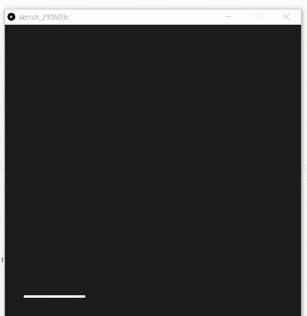

# 如何使用 p5.js 绘制简单的动画？

> 原文:[https://www . geesforgeks . org/how-draw-simple-animation-using-P5-js/](https://www.geeksforgeeks.org/how-to-draw-simple-animation-using-p5-js/)

动画是一种方法，其中一组图像以特定的方式组合并处理，然后它们作为运动图像出现。构建动画使屏幕上的对象看起来像是活的。

在本文中，我们将学习在 p5.js 中通过使用**线条、** **矩形和椭圆**来制作房屋的各个部分，从而制作一个简单的房屋动画。

**进场:**

*   制作一个列表来存储房子的所有顶点。
*   声明两个变量 iter 和 counter。
*   设置函数设置()，其中输出窗口的大小、颜色和背景，将 iter 和计数器的值初始化为 1，并初始化顶点列表。
*   设置添加笔画、笔画粗细的函数。
*   设置一个 if 条件，在范围内检查 iter 如果是，将计数器增加 0.05，如果没有出口，则将计数器的上限值设为 iter。
*   函数添加房屋的顶点，将直线的起点和终点作为添加顶点()。
*   现在制作绘制房屋各部分的函数:
*   使函数在房屋中绘制垂直线和水平线。
*   制作绘制方形窗口的函数
*   使函数绘制门。
*   使函数绘制圆形窗口。
*   制作绘制烟囱的函数。
*   经过这一步，现在创建一个开关盒，逐步添加房子的所有部分。

**以下是上述方法的实现:**

## java 描述语言

```
// List to store all the vertices
let vertices = [];

// Variable declared
var iter;
var counter;

// Function to set up output window
function setup() {

    // Size of output window
    createCanvas(600, 600);

    // Fill the color
    fill(31);

    // Background of output window
    background(31);

    // Put the value of variables as 1
    iter = 1;
    counter = 1;

    // Initialize the list of vertices
    addVertices();
}

// Set the draw function
function draw() {

    stroke(255);
    strokeWeight(4);
    step();

    // Condition to check within bound
    if (iter < 11) {

        // Increase counter everytime
        counter += 0.05;

        // Set the iter variable to the
        // floor value of counter
        iter = floor(counter);
    }
    else {

        // If iter increases by 11 then
        // stop the loop
        noLoop();
    }
}

// Function to add vertices of house giving
// start and end point of line
function addVertices() {
    vertices.push(new p5.Vector(100, 300));
    vertices.push(new p5.Vector(340, 300));
    vertices.push(new p5.Vector(40, 380));
    vertices.push(new p5.Vector(160, 380));
    vertices.push(new p5.Vector(400, 380));
    vertices.push(new p5.Vector(40, 550));
    vertices.push(new p5.Vector(160, 550));
    vertices.push(new p5.Vector(400, 550));
}

// Function to draw lines in house
function drawLine(a, b) {
    line(vertices[a].x, vertices[a].y,
        vertices[b].x, vertices[b].y);
}

// Function to draw gate
function addGate() {
    rectMode(CENTER);
    rect(100, 500, 70, 100);
}

// Function  to draw window
function addWindow() {
    rect(280, 430, 40, 30);
}

// Function to add  circular window
function addOculus() {
    ellipse(100, 340, 20, 20);
}

// Function to add Chimney
function addChimney() {
    rect(320, 295, 16, 20);
    ellipse(320, 285, 16, 10);
}

// Function to draw parts of
// house step by step
function step() {
    switch (iter) {
        case 1:
            drawLine(5, 6);
            break;
        case 2:
            drawLine(6, 7);
            break;
        case 3:
            drawLine(2, 5);
            drawLine(3, 6);
            break;
        case 4:
            drawLine(4, 7);
            break;
        case 5:
            drawLine(2, 3);
            drawLine(3, 4);
            break;
        case 6:
            drawLine(0, 2);
            drawLine(0, 3);
            drawLine(1, 4);
            break;
        case 7:
            drawLine(0, 1);
            break;
        case 8:
            addGate();
            break;
        case 9:
            addWindow();
            break;

        case 10:
            addOculus();
            break;
        case 11:
            addChimney();
            break;
    }
}
```

**输出:**

