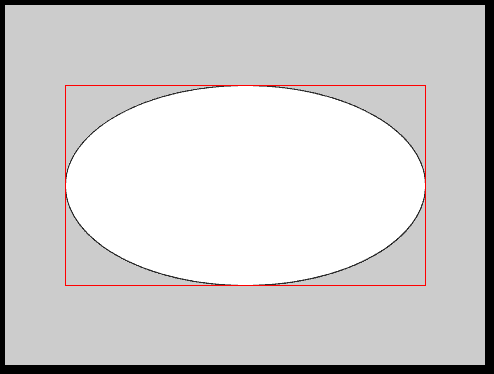
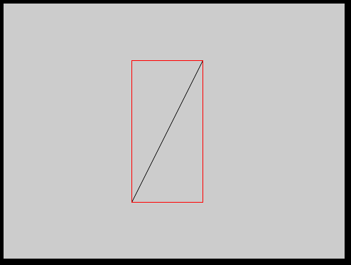
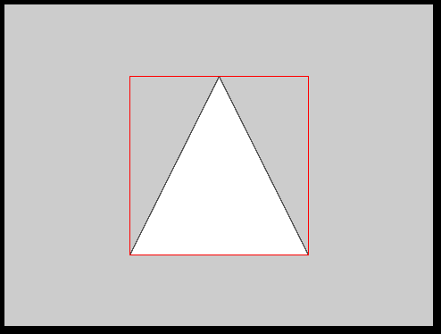
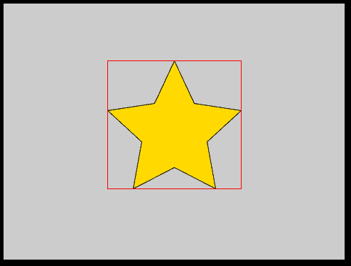

# 如何在 p5.js 中获取不同形状的包围盒？

> 原文:[https://www . geesforgeks . org/如何获得不同形状的边界框-in-p5-js/](https://www.geeksforgeeks.org/how-to-get-bounding-box-of-different-shapes-in-p5-js/)

在本文中，我们将看到如何获得不同形状的边界框。我们将使用 [P5.js](https://www.geeksforgeeks.org/p5-js-introduction/) ，这是一个 Javascript 框架创意编程环境，非常受 Processing 启发。

**边界框:**边界框基本上只是一个界定形状的矩形，更确切地说，是具有最小可能表面积的矩形界定了形状。一个边界框可以有旋转(称为**全局**边界框)，但是在本文中，我们将聚焦于轴对齐的边界框(AABB 形状)，这些边界框中没有旋转(也称为**局部**边界框)

**注意:**形状的边界框是具有最小可能表面积的矩形，它限定了形状的边界。

**计算边界框的原因:**边界框充当形状的容器，在图形应用程序中有几个应用程序(最著名的是用于小部件遮罩的图形用户界面库)。因为边界框包含形状，所以如果任何其他形状不与边界框相交，那么它也不与内部形状相交，因此边界框在物理引擎(如 Box2D)中被大量用于宽相位碰撞检测。

**p5.js 的基础:**这是基础代码(通常为每个 P5 . js 代码)。

```
<!-- Our main HTML file! -->
<html>
  <head>
    <script src="https://cdn.jsdelivr.net/npm/p5"></script>
    <script src="sketch.js"></script>
  </head>
  <body>
  </body>
</html>
```

**注意:**我们每次迭代只会修改 **script.js** ，HTML 文件必然会保持不变！

*   **Finding bounding-box of an ellipse:**

    ```
    /* p5.js Sketch for finding and drawing
       bounding-box of an ellipse*/
    function setup(){
      createCanvas(480, 360);
    }

    // Draws bounding-box around the
    // given ellipse!
    function drawBBox(x0, y0, r1, r2){

      // Draw only the outline
      // of the rectangle
      noFill();

      // Draw the outline in red
      stroke(255, 0, 0);
      rect(x0-r1, y0-r2, 2*r1, 2*r2);
    }
    function draw() {
      let x0 = width/2, y0 = height/2;
      let r1 = 180, r2 = 100;

      // Note that `ellipse` takes in
      // diameters not radii!
      ellipse(x0, y0, 2*r1, 2*r2);
      drawBBox(x0, y0, r1, r2);

      // We don't want to draw this
      // over and over again
      noLoop();
    }
    ```

    **输出:**
    

*   **求圆的包围盒:**它和**椭圆**一样，因为圆只是半径相同(半长轴和半短轴相同)的椭圆的特例。
*   **Finding bounding-box of a line-segment**

    ```
    /* p5.js Sketch for finding and drawing
      bounding-box of a line-segment*/
    function setup() {
      createCanvas(480, 360);
    }

    // Draws bounding-box around the
    // given line-segment!
    function drawBBox(x1, y1, x2, y2) {
      stroke(255, 0, 0);
      noFill();
      let x = min(x1, x2), y = min(y1, y2);
      let w = max(x1, x2) - x, h = max(y1, y2) - y;
      rect(x, y, w, h);
    }

    function draw() {
      let x1 = 280, y1 = 80, x2 = 180, y2 = 280;
      line(x1, y1, x2, y2);
      drawBBox(x1, y1, x2, y2);
      noLoop();
    }
    ```

    **输出:**
    

*   **Finding bounding-box of a triangle:** Finding bounding-box of a triangle is very similar to finding bounding-box for **line-segment.**

    ```
    /* p5.js Sketch for finding and drawing
      bounding-box of a triangle*/
    function setup() {
      createCanvas(480, 360);
    }

    // Draws bounding-box around the
    // given triangle!
    function drawBBox(x1, y1, x2, y2, x3, y3) {
      stroke(255, 0, 0);
      noFill();
      let x = min(x1, x2, x3), y = min(y1, y2, y3);
      let w = max(x1, x2, x3) - x, h = max(y1, y2, y3) - y;
      rect(x, y, w, h);
    }

    function draw() {
      let x1 = 240, y1 = 80, x2 = 140;
      let y2 = 280, x3 = 340, y3 = 280;

      triangle(x1, y1, x2, y2, x3, y3);
      drawBBox(x1, y1, x2, y2, x3, y3);
      noLoop();
    }
    ```

    **输出:**
    

*   **Finding bounding-box of a polygon:** A triangle is a polygon, and if we find the **bounding-box of a triangle** then finding bounding-box for polygon shouldn’t be any difficulty. We just have to generalize so that we can have any number of vertices and we are done.

    ```
    /* p5.js sketch for finding and drawing
      bounding-box of a polygon*/
    function setup() {
      createCanvas(480, 360);
    }

    // Draws bounding-box around
    // the given polygon!
    function drawBBox(x, y) {
      stroke(255, 0, 0);
      noFill();
      let rx = min(x), ry = min(y);
      let w = max(x) - rx, h = max(y) - ry;
      rect(rx, ry, w, h);
    }

    function draw(){
      /* Vertices for a star-polygon (decagon) */
      let x = [240, 268, 334, 286, 298,
               240, 182, 194, 146, 212];
      let y = [80, 140, 150, 194, 260,
               230, 260, 194, 150, 140];

      beginShape();

      for (let i = 0; i < x.length; ++i)
        vertex(x[i], y[i]);
      fill(255, 217, 0);

      // If you don't CLOSE it then it'd
      // draw a chained line-segment
      endShape(CLOSE);
      drawBBox(x, y);
      noLoop();
    }
    ```

    **输出:**
    

寻找包围盒是可视化应用的一个重要部分。此外，在游戏等动态应用中，无法在每一帧计算胶囊碰撞检测而不导致性能损失。因此，在任何复杂的碰撞检查之前，都会对早期退出进行广泛的阶段检查，一旦确定该形状没有与其他形状碰撞，就会返回 false。如果通过了宽相位检查，那么就进入了实际碰撞检测(OOBB、SAT、太空舱、椭球体等)发生的窄相位！因此，出于各种原因，找到边界框是许多图形丰富的应用程序的重要部分。