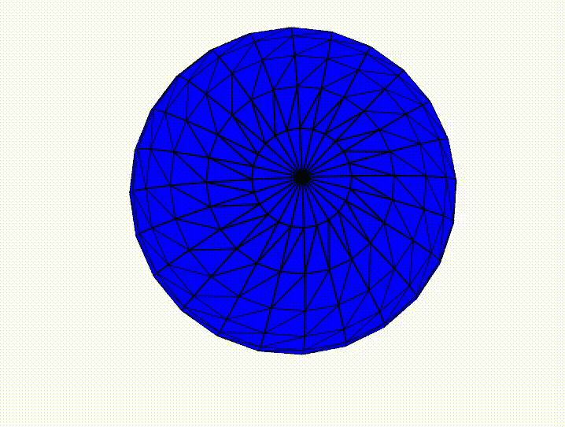
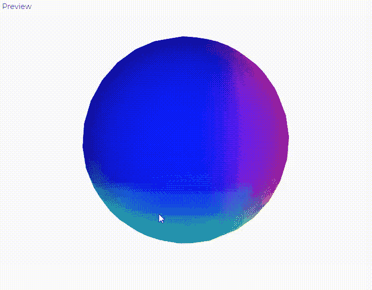
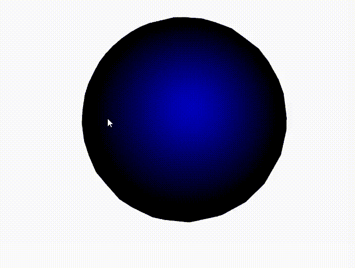

# WebGL 和 p5.js 中的灯

> 原文:[https://www.geeksforgeeks.org/lights-in-webgl-and-p5-js/](https://www.geeksforgeeks.org/lights-in-webgl-and-p5-js/)

在本文中，我们将学习如何在 p5.js 中应用不同类型的灯光。照明是一种简单但强大的方法，可以在 p5.js 草图中提供深度和真实感。p5.js 中有三种类型的灯:

*   **环境光:**它是三种灯光中最简单的。它甚至为后来绘制的对象提供环境照明。需要一个 p5。颜色对象或 RGB 数值作为参数。使用**环境光线()**方法定义。
*   **定向光:**定向光的光线在给定的方向上发光，没有任何特定的原点。它不能靠近或远离任何几何图形。使用**方向灯()**方法定义。
*   **点光源:**点光源以颜色和位置为参数。它从一个特定的原点发出光，因此当它离一个物体更远或更近时，它的反射是不同的。它是使用 **[点光源()](https://www.geeksforgeeks.org/p5-js-pointlight-function/)** 方法定义的。

**示例 1:** 使用 ambientLight()方法创建环境光。

## java 描述语言

```
let angle = 0.3;

function setup() {
  createCanvas(600, 400, WEBGL);
}

function draw() {

  // Set the blue light 
  ambientLight(0,0,255);

  // Set the background
  background(250);

  // Set the material
  ambientMaterial(255);

  // Rotate on all three axis.
  rotateX(angle*0.3);
  rotateY(angle*0.6);
  rotateZ(angle*0.9);

  // Set the shape
  sphere(150);

  angle +=0.06;
}
```

**输出:**



**示例 2:** 使用 directionalLight()方法创建方向光。

## java 描述语言

```
let angle = 0.3;

function setup() {
  createCanvas(600, 400, WEBGL);
}

function draw() {
  let dirY = (mouseY / height - 0.5) *2;
  let dirX = (mouseX / width - 0.5) *2;

  // Set the directional light 
  directionalLight(0, 0, 250, dirX, -dirY, 0.25);

  // Set the background
  background(250);

  // Set the material
  normalMaterial();

  // Rotate on all three axes
  rotateX(angle*0.3);
  rotateY(angle*0.6);
  rotateZ(angle*0.9);

  // Set the shape
  sphere(150);

  angle +=0.06;
}
```

**输出:**



**示例 3:** 使用 pointLight()方法创建点光源。

## java 描述语言

```
let angle = 0.3;

function setup() {
  createCanvas(600, 400, WEBGL);
}

function draw() {

  // Set a point light in the given direction
  pointLight(0, 0, 255, mouseX - 200, mouseY - 200, 200);

  // Set the background
  background(250);

  // Set the material
  ambientMaterial(255);

  // Rotate on all three axes
  rotateX(angle*0.3);
  rotateY(angle*0.6);
  rotateZ(angle*0.9);
  noStroke();

  // Set the shape
  sphere(150);

  angle +=0.06;
}
```

**输出:**

