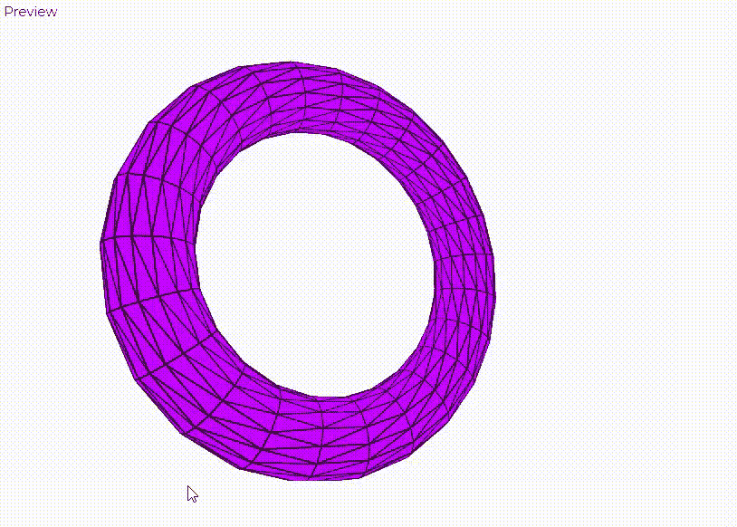
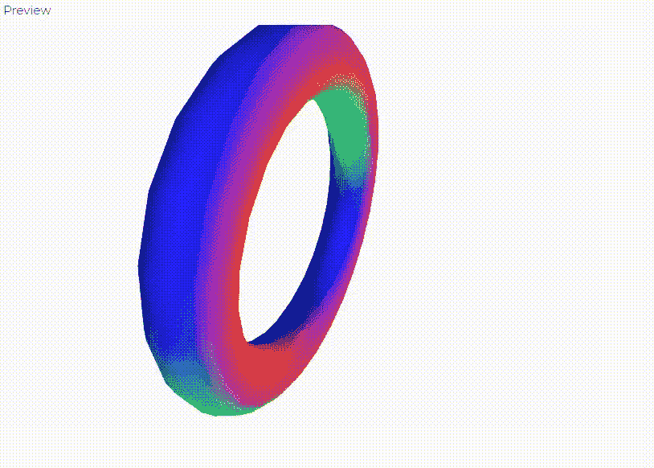
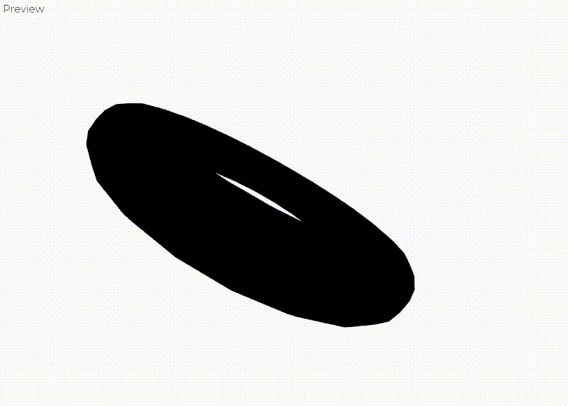
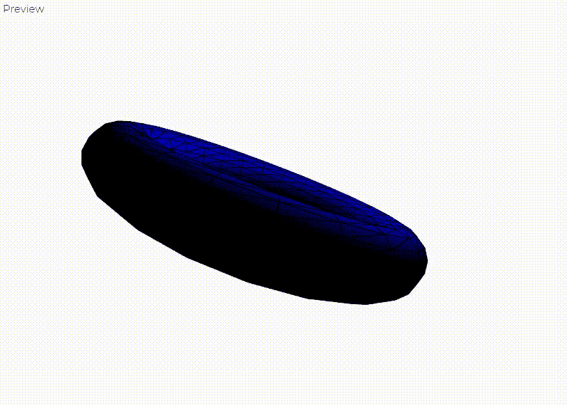
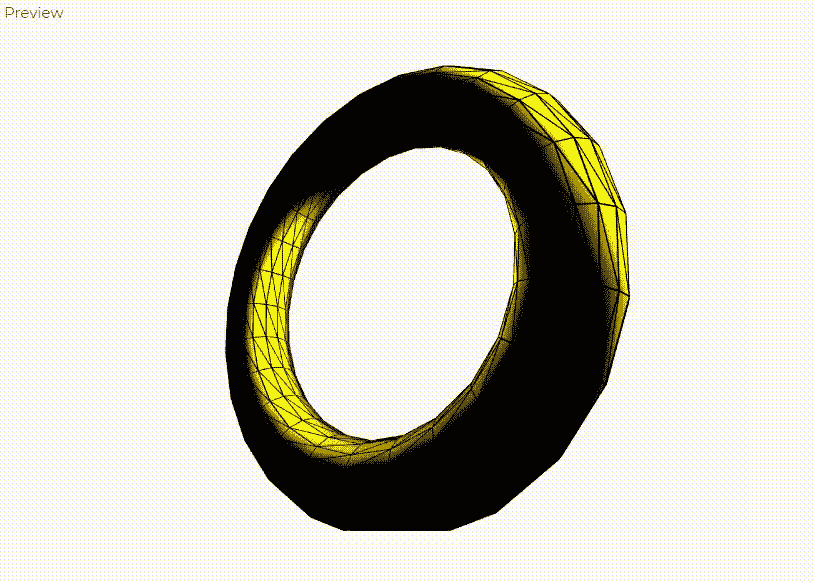

# WebGL 和 p5.js 中的材料

> 原文:[https://www.geeksforgeeks.org/materials-in-webgl-and-p5-js/](https://www.geeksforgeeks.org/materials-in-webgl-and-p5-js/)

在本文中，我们将学习如何在 WebGL 中应用不同类型的材料。根据物体的反射角度和材料，光在物体上的反射不同。p5.js 中有四种类型的材料:

*   **基本材质:**用给定的颜色填充几何体，但不受光线影响。用[填充()](https://www.geeksforgeeks.org/p5-js-fill-function/#:~:text=The%20fill()%20function%20is,color%20or%20named%20color%20string.)方法定义。
*   **正常材质:**不取任何参数，自动映射到 RGB 颜色空间。使用[标准物质()](https://www.geeksforgeeks.org/p5-js-normalmaterial-function/)方法定义。
*   **环境材料:**只有当有特定颜色的光时，它才会反射。用[环境材料()](https://www.geeksforgeeks.org/p5-js-ambientmaterial-function/)方法定义。
*   **镜面材质:**是四种材质中最逼真的。镜面反射是一种技术方法，用来描述一种向单一方向反射光线的材料。它是用[投机材料()](https://www.geeksforgeeks.org/p5-js-specularmaterial-function/)方法定义的。

**示例 1:** 使用 fill()方法。

## java 描述语言

```
let angle = 0.3;

function setup() {
  createCanvas(600, 400, WEBGL);
}

function draw() {

  // Set the background
  background(250);

  fill(200,0,255);

  push();

  // Rotate on all three axis.
  rotateX(angle*0.3);
  rotateY(angle*0.6);
  rotateZ(angle*0.9);

  // Set the shape
  torus(150, 30);

  angle +=0.06;
  pop();
}
```

**输出:**



**示例 2:** 使用 normalMaterial()方法。

## java 描述语言

```
let angle = 0.3;

function setup() {
  createCanvas(600, 400, WEBGL);
}

function draw() {

  // Set the background
  background(250);

  // Set the material type.
  normalMaterial();

  push();

  // Rotate on all three axis.
  rotateX(angle*0.3);
  rotateY(angle*0.6);
  rotateZ(angle*0.9);

  // Set the shape
  torus(150, 30);

  angle +=0.06;
  pop();
}
```

**输出:**



**例 3:** 在没有光线的情况下使用 ambientMaterial()。

## java 描述语言

```
let angle = 0.3;

function setup() {
  createCanvas(600, 400, WEBGL);
}

function draw() {

  // Set the background
  background(250);

  // Set the material
  ambientMaterial(0,0,255);
  push();

  // Rotate on all three axis.
  rotateX(angle*0.3);
  rotateY(angle*0.6);
  rotateZ(angle*0.9);

  // Set the shape
  torus(150, 30);

  angle +=0.06;
  pop();
}
```

**输出:**



**示例 4:** 当有光被反射时，使用 ambientMaterial()。

## java 描述语言

```
let angle = 0.3;

function setup() {
  createCanvas(600, 400, WEBGL);
}

function draw() {

  //set the  light 
  pointLight(0,0,255 ,200,-200,0)

  // Set the background
  background(250);

  // Set the material
  ambientMaterial(0,0,255);
  push();

  // Rotate on all three axis.
  rotateX(angle*0.3);
  rotateY(angle*0.6);
  rotateZ(angle*0.9);

  // Set the shape
  torus(150, 30);

  angle +=0.06;
  pop();
}
```

**输出:**



**例 4:** 使用镜报材料()方法。

## java 描述语言

```
let angle = 0.3;

function setup() {
  createCanvas(600, 400, WEBGL);
}

function draw() {

  // Set the  light 
  pointLight(255,255,0 ,200,-200,0)

  // Set the background
  background(250);

  // Set the material
  specularMaterial(250, 0, 0);
  push();

  // Rotate on all three axis.
  rotateX(angle*0.3);
  rotateY(angle*0.6);
  rotateZ(angle*0.9);

  //Set the shape
  torus(150, 30);

  angle +=0.06;
  pop();
}
```

**输出:**

