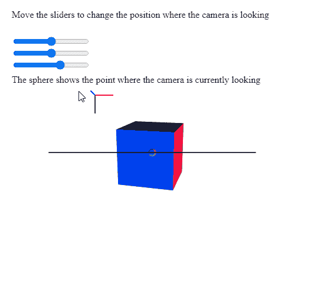
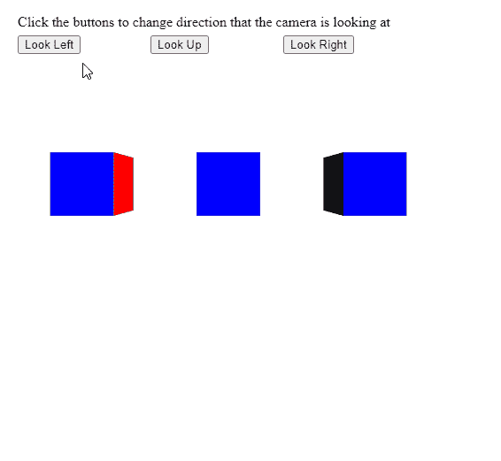

# p5。摄像头观察()方法

> 原文:[https://www.geeksforgeeks.org/p5-camera-lookat-method/](https://www.geeksforgeeks.org/p5-camera-lookat-method/)

p5 的 **lookAt()方法**。p5.js 中的 Camera 用于重新定向相机，以查看世界空间中的给定位置。在重新定向过程中，摄像机的位置不会改变。

**语法:**

```
lookAt( x, y, z )

```

**参数:**该方法接受三个参数，如上所述，如下所述:

*   **x:** 是表示该点在世界空间中的 x 位置的数字。
*   **y:** 是表示世界空间中点的 y 位置的数字。
*   **z:** 是表示世界空间中点的 z 位置的数字。

下面的例子说明了 p5.js 中的 **lookAt()方法**:

**例 1:**

## java 描述语言

```
let currCamera;

function setup() {
  createCanvas(500, 500, WEBGL);
  helpText = createP(
    "Move the sliders to change the " +
    "position where the camera is looking"
  );
  helpText2 = createP(
    "The sphere shows the point where " +
    "the camera is currently looking"
  );
  helpText.position(20, 0);
  helpText2.position(20, 110);

  // Create the camera
  currCamera = createCamera();

  // Create three sliders for changing the
  // direction that the camera will look at
  xPosSlider = createSlider(-360, 360, 0);
  xPosSlider.position(20, 60);

  yPosSlider = createSlider(-360, 360, 0);
  yPosSlider.position(20, 80);

  zPosSlider = createSlider(-360, 360, 100);
  zPosSlider.position(20, 100);
}

function draw() {
  clear();
  lights();
  normalMaterial();
  debugMode();

  // Get the x, y, z values from the
  // sliders
  let currX = xPosSlider.value();
  let currY = yPosSlider.value();
  let currZ = zPosSlider.value();

  // Look at the given points in 
  // the world space
  currCamera.lookAt(currX, currY, currZ);

  // Show the point where the camera is
  // currently looking at (for demonstration)
  translate(currX, currY, currZ);
  sphere(5);
  translate(-currX, -currY, -currZ);

  rotateX(50);
  rotateY(50);
  box(90);
}
```

**输出:**



**例 2:**

## java 描述语言

```
let currCamera;
let currX = 0;
let currY = 0;
let currZ = 0;

function setup() {
  createCanvas(500, 400, WEBGL);
  helpText = createP(
    "Click the buttons to change direction " +
    "that the camera is looking at");
  helpText.position(20, 0);

  currCamera = createCamera();

  // Create three buttons for changing the
  // direction of the camera
  newCameraBtn = createButton("Look Left");
  newCameraBtn.position(20, 40);
  newCameraBtn.mouseClicked(lookLeftCamera);

  newCameraBtn = createButton("Look Up");
  newCameraBtn.position(170, 40);
  newCameraBtn.mouseClicked(lookUpCamera);

  newCameraBtn = createButton("Look Right");
  newCameraBtn.position(320, 40);
  newCameraBtn.mouseClicked(lookRightCamera);
}

function lookLeftCamera() {
  currX = currX - 25;

  // Look at the given position
  // in the world space
  currCamera.lookAt(currX, currY, currZ);
}

function lookUpCamera() {
  currY = currY - 25;

  // Look at the given position
  // in the world space
  currCamera.lookAt(currX, currY, currZ);
}

function lookRightCamera() {
  currX = currX + 25;

  // Look at the given position
  // in the world space
  currCamera.lookAt(currX, currY, currZ);
}

function draw() {
  clear();
  normalMaterial();

  // Create three boxes at three positions
  translate(-150, 0);
  box(65);
  translate(150, 0);
  box(65);
  translate(150, 0);
  box(65);
}
```

**输出:**



**在线编辑:**[https://editor.p5js.org/](https://editor.p5js.org/)

**环境设置:**

**参考:**T2】https://p5js.org/reference/#/p5.Camera/lookAt