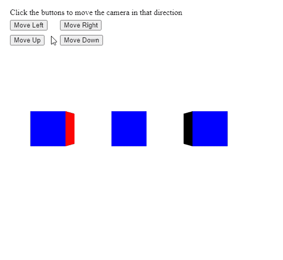
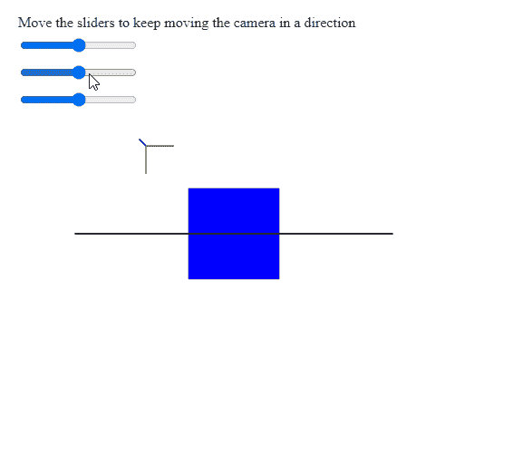

# p5。摄像机移动()方法

> 原文:[https://www.geeksforgeeks.org/p5-camera-move-method/](https://www.geeksforgeeks.org/p5-camera-move-method/)

p5 的**移动()方法**。p5.js 中的 Camera 用于将相机沿其局部轴移动指定的量。它在移动时保持当前的相机方向。

**语法:**

```
move( x, y, z )
```

**参数:**该方法接受三个参数，如上所述，如下所述:

*   **x:** 是一个数字，表示摄像机沿其左右轴移动的量。
*   **y:** 是表示摄像机沿其上下轴移动量的数字。
*   **z:** 是表示摄像机沿其前后轴移动量的数字。

下面的例子说明了 p5.js 中的 **move()方法**:

**例 1:**

## java 描述语言

```
let currCamera;

function setup() {
  createCanvas(500, 500, WEBGL);
  helpText = createP(
    "Click the buttons to move the " +
    "camera in that direction");
  helpText.position(20, 0);

  currCamera = createCamera();

  // Create three buttons for moving the
  // position camera
  newCameraBtn = createButton("Move Left");
  newCameraBtn.position(20, 40);
  newCameraBtn.mouseClicked(moveCameraLeft);

  newCameraBtn = createButton("Move Right");
  newCameraBtn.position(120, 40);
  newCameraBtn.mouseClicked(moveCameraRight);

  newCameraBtn = createButton("Move Up");
  newCameraBtn.position(20, 70);
  newCameraBtn.mouseClicked(moveCameraUp);

  newCameraBtn = createButton("Move Down");
  newCameraBtn.position(120, 70);
  newCameraBtn.mouseClicked(moveCameraDown);
}

function moveCameraLeft() {

  // Look at the given position
  // in the world space
  currCamera.move(-15, 0, 0);
}

function moveCameraRight() {

  // Look at the given position
  // in the world space
  currCamera.move(15, 0, 0);
}

function moveCameraUp() {

  // Look at the given position
  // in the world space
  currCamera.move(0, -15, 0);
}

function moveCameraDown() {

  // Look at the given position
  // in the world space
  currCamera.move(0, 15, 0);
}

function draw() {
  clear();
  normalMaterial();

  // Create three boxes at three positions
  translate(-150, 0);
  box(65);
  translate(150, 0);
  box(65);
  translate(150, 0);
  box(65);
}
```

**输出:**



**例 2:**

## java 描述语言

```
let currCamera;

function setup() {
  createCanvas(500, 500, WEBGL);
  helpText = createP(
    "Move the sliders to keep moving " +
    "the camera in a direction"
  );
  helpText.position(20, 0);

  // Create the camera
  currCamera = createCamera();

  // Create three sliders for moving the
  // position of the camera
  xPosSlider = createSlider(-2, 2, 0);
  xPosSlider.position(20, 40);

  yPosSlider = createSlider(-2, 2, 0);
  yPosSlider.position(20, 70);

  zPosSlider = createSlider(-2, 2, 0);
  zPosSlider.position(20, 100);
}

function draw() {
  clear();
  lights();
  normalMaterial();
  debugMode();

  // Get the x, y, z values from the
  // sliders
  let currX = xPosSlider.value();
  let currY = yPosSlider.value();
  let currZ = zPosSlider.value();

  // Keep moving the camera according to
  // to the given amount
  currCamera.move(currX, currY, currZ);

  box(90);
}
```

**输出:**



**在线编辑:**[https://editor.p5js.org/](https://editor.p5js.org/)

**环境设置:**

**参考:**T2】https://p5js.org/reference/#/p5.Camera/move