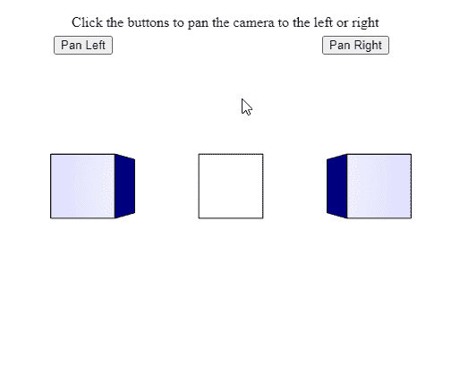

# p5。相机云台()方法

> 原文:[https://www.geeksforgeeks.org/p5-camera-pan-method/](https://www.geeksforgeeks.org/p5-camera-pan-method/)

p5 的 **pan()方法**。p5.js 中的 Camera 用于旋转视图，即根据给定的旋转量平移相机。通过逆时针或顺时针旋转相机，可以向左或向右平移相机。

**语法:**

```
pan( angle )

```

**参数:**该方法接受如上所述的单个参数，如下所述:

*   **角度:**是一个数字，表示相机必须旋转的量。可以使用 angleMode()方法指定要使用的旋转单位。大于 0 的值将逆时针旋转相机，即向左平移相机。同样，对于负值，相机将顺时针方向旋转。

下面的例子说明了 p5.js 中的 **pan()方法**:

**示例:**

## java 描述语言

```
let currCamera;

function setup() {
  createCanvas(500, 400, WEBGL);
  helpText = createP(
    "Click the buttons to pan the camera " +
    "to the left or right");
  helpText.position(80, 0);

  currCamera = createCamera();

  // Set the angle mode in degrees
  angleMode(DEGREES);

  // Create the buttons for panning the camera
  newCameraBtn = createButton("Pan Left");
  newCameraBtn.position(60, 40);
  newCameraBtn.mouseClicked(panCameraLeft);

  newCameraBtn = createButton("Pan Right");
  newCameraBtn.position(360, 40);
  newCameraBtn.mouseClicked(panCameraRight);
}

function panCameraLeft() {

  // Pan the camera to the left
  // that is, rotate counterclockwise
  // using a value greater than 0
  currCamera.pan(10);
}

function panCameraRight() {

  // Pan the camera to the right
  // that is, rotate clockwise
  // using a value less than 0
  currCamera.pan(-10);
}

function draw() {
  clear();
  lights();
  specularMaterial('blue');

  // Create three boxes at three positions
  translate(-150, 0);
  box(65);
  translate(150, 0);
  box(65);
  translate(150, 0);
  box(65);

  // Draw 2 spheres only visible after
  // panning left and right
  translate(0, 0, 250);
  sphere(30);
  translate(-300, 0, 0);
  sphere(30);
}
```

**输出:**



**在线编辑:**[https://editor.p5js.org/](https://editor.p5js.org/)

**环境设置:**

**参考:**T2】https://p5js.org/reference/#/p5.Camera/pan