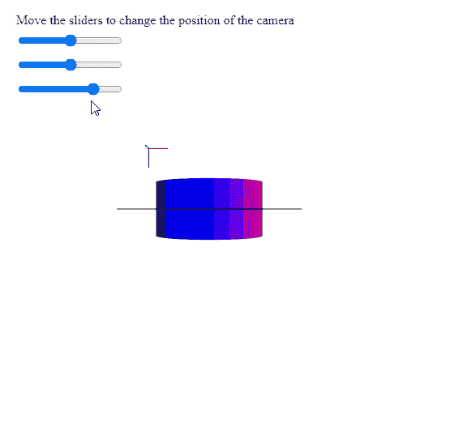

# p5。摄像头设置位置()方法

> 原文:[https://www.geeksforgeeks.org/p5-camera-setposition-method/](https://www.geeksforgeeks.org/p5-camera-setposition-method/)

p5 的**设定位置()方法**。p5.js 中的 Camera 用于设置相机在世界空间中给定点的位置。它在改变位置的同时保持当前的相机方向。

**语法:**

```
setPosition( x, y, z )

```

**参数:**该方法接受三个参数，如上所述，如下所述:

*   **x:** 是表示该点在世界空间中的 x 位置的数字。
*   **y:** 是表示世界空间中点的 y 位置的数字。
*   **z:** 是表示世界空间中点的 z 位置的数字。

下面的例子说明了 p5.js 中的**设定位置()方法**:

**示例:**

## java 描述语言

```
let currCamera;

function setup() {
  createCanvas(500, 500, WEBGL);
  helpText = createP(
    "Move the sliders to change the " +
    "position of the camera"
  );
  helpText.position(20, 0);

  // Create the camera
  currCamera = createCamera();

  // Create three sliders for changing the
  // position of the camera
  xPosSlider = createSlider(-360, 360, 0);
  xPosSlider.position(20, 40);

  yPosSlider = createSlider(-360, 360, 0);
  yPosSlider.position(20, 70);

  zPosSlider = createSlider(0, 800, 600);
  zPosSlider.position(20, 100);
}

function draw() {
  clear();
  lights();
  normalMaterial();
  debugMode();

  // Get the x, y, z values from the
  // sliders
  let currX = xPosSlider.value();
  let currY = yPosSlider.value();
  let currZ = zPosSlider.value();

  // Set the position of the camera
  // to these points in the world space
  currCamera.setPosition(currX, currY, currZ);

  cylinder(90);
}
```

**输出:**



**在线编辑:**[https://editor.p5js.org/](https://editor.p5js.org/)

**环境设置:**

**参考:**T2】https://p5js.org/reference/#/p5.Camera/setPosition