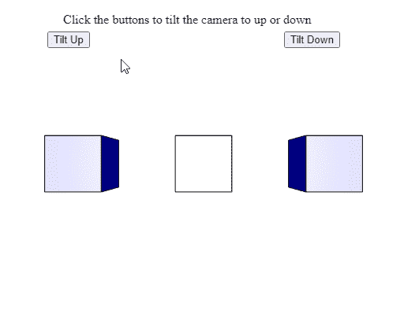

# p5。摄像机倾斜()方法

> 原文:[https://www.geeksforgeeks.org/p5-camera-tilt-method/](https://www.geeksforgeeks.org/p5-camera-tilt-method/)

p5 的**倾斜()方法**。p5.js 中的 Camera 用于根据给定的旋转量旋转相机的视图，即平移。通过使用正负旋转值旋转相机，可以上下摇动相机。

**语法:**

```
tilt( angle )

```

**参数:**该方法接受如上所述的单个参数，如下所述:

*   **角度:**是一个数字，表示相机必须旋转的量。可以使用 angleMode()方法指定要使用的旋转单位。小于 0 的值会将摄像机向上平移。类似地，大于 0 的值会将摄像机向下平移。

下面的例子说明了 p5.js 中的 **tilt()方法**:

**示例:**

## java 描述语言

```
let currCamera;

function setup() {
  createCanvas(500, 400, WEBGL);
  helpText = createP(
    "Click the buttons to tilt " +
    "the camera to up or down");
  helpText.position(80, 0);

  currCamera = createCamera();

  // Set the angle mode to be used
  angleMode(DEGREES);

  // Create three buttons for tilting the camera
  newCameraBtn = createButton("Tilt Up");
  newCameraBtn.position(60, 40);
  newCameraBtn.mouseClicked(tiltCameraUp);

  newCameraBtn = createButton("Tilt Down");
  newCameraBtn.position(360, 40);
  newCameraBtn.mouseClicked(tiltCameraDown);
}

function tiltCameraUp() {

  // Tilt the camera up using
  // a value less than 0
  currCamera.tilt(-10);
}

function tiltCameraDown() {

  // Tilt the camera up using
  // a value greater than 0
  currCamera.tilt(10);
}

function draw() {
  clear();
  lights();
  specularMaterial('blue');

  // Create three boxes at three positions
  translate(-150, 0);
  box(65);
  translate(150, 0);
  box(65);
  translate(150, 0);
  box(65);
  translate(-150, 0);

  // Draw 2 spheres only visible after
  // tilting up and down
  translate(0, 300, 0);
  sphere(50);
  translate(0, -600, 0);
  sphere(50);
}
```

**输出:**



**在线编辑:**[https://editor.p5js.org/](https://editor.p5js.org/)

**环境设置:**

**参考:**T2】https://p5js.org/reference/#/p5.Camera/tilt