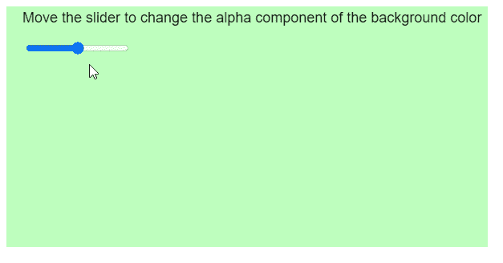

# p5。颜色设置阿尔法()方法

> 原文:[https://www.geeksforgeeks.org/p5-color-setalpha-method/](https://www.geeksforgeeks.org/p5-color-setalpha-method/)

p5.js 中的 **setAlpha()方法**用于设置一个 p5 的 Alpha 分量。颜色对象。alpha 值的范围取决于当前的颜色模式。在默认的 RGB 颜色模式下，该值可以在 0 到 255 之间。

**语法:**

```
setAlpha( alpha )

```

**参数:**该方法接受如上所述的单个参数，如下所述:

*   **α:**是表示新α值的数字。

下面的例子说明了 p5.js 中的 **setAlpha()方法**:

**例 1:**

## java 描述语言

```
function setup() {
  createCanvas(600, 300);

  alphaSlider = createSlider(0, 255, 128);
  alphaSlider.position(30, 50);
}

function draw() {
  clear();
  textSize(18);

  // Get the alpha value from the slider
  let alphaValue = alphaSlider.value();

  let newColor = color(128, 255, 128);

  // Set the alpha value of the color
  newColor.setAlpha(alphaValue);

  background(newColor);
  fill('black');
  text("Move the slider to change the " +
       "alpha component of the background color",
       20, 20);

}
```

**输出:**



**例 2:**

## java 描述语言

```
function setup() {
  createCanvas(600, 300);

  alphaSlider = createSlider(0, 255, 128);
  alphaSlider.position(30, 50);
}

function draw() {
  clear();
  textSize(18);

  noFill();
  stroke(0);
  strokeWeight(50);
  ellipse(width / 2, height / 2, 150);
  strokeWeight(1);

  // Get the alpha value from the slider
  let alphaValue = alphaSlider.value();

  let newColor = color(255, 128, 128);

  // Set the alpha value of the color
  newColor.setAlpha(alphaValue);

  noStroke();
  background(newColor);
  fill('black');
  text(
    "Move the slider to change the " +
    "alpha component of the background color",
    20, 20);

}
```

**输出:**


**在线编辑:**[https://editor.p5js.org/](https://editor.p5js.org/)

**环境设置:**

**参考:**T2】https://p5js.org/reference/#/p5.Color/setAlpha