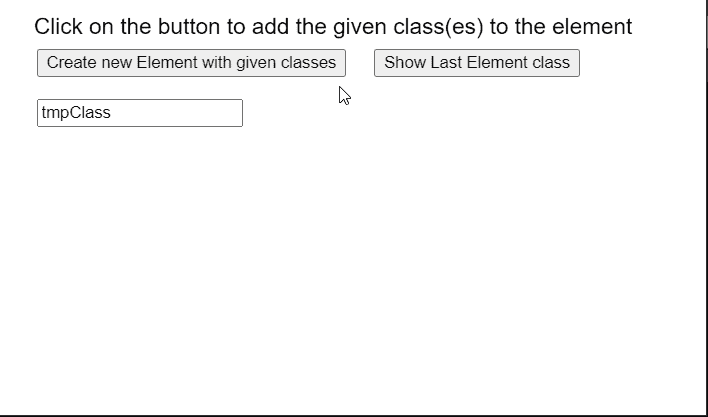

# p5。元素类()方法

> 原文:[https://www.geeksforgeeks.org/p5-element-class-method/](https://www.geeksforgeeks.org/p5-element-class-method/)

p5 的**类()**方法。p5.js 中的元素用于设置或返回元素的类。当没有类被指定为参数时，它返回元素的当前类。一个元素可以分配多个类。此外，一个类可以指定给页面上的多个元素。

**语法:**

```
class(class)

```

**参数:**该函数接受一个参数，如上所述，如下所述

*   **类:**是表示元素类的字符串。

**示例:**下面的示例说明了 p5.js 中的**类()**方法。

## java 描述语言

```
function setup() {
  createCanvas(550, 300);
  textSize(18);

  text("Click on the button to add the given " +
       "class(es) to the element", 20, 20);

  setBtn = 
    createButton("Create new Element with given classes");
  setBtn.position(30, 40);
  setBtn.mouseClicked(createNewElement);

  setBtn = 
    createButton("Show Last Element class");
  setBtn.position(300, 40);
  setBtn.mouseClicked(showClasses);

  class_name = createInput('tmpClass');
  class_name.position(30, 80);
}

function createNewElement() {
  clear();

  // Create a new p5.Element
  tmpElement = createElement("div");

  // Get the class to set
  let classToSet = class_name.value();

  // Set the class of the element
  tmpElement.class(classToSet);

  text("Class set with the names: " +
       classToSet, 30, 120);

  text("Click on the button to add the given " +
       "class(es) to the element", 20, 20);
}

function showClasses() {
  clear();

  // Get the classes of the element
  let setClasses = tmpElement.class();

  // Display the classes
  text("The classes of the element are: " +
       setClasses, 30, 120);

  text("Click on the button to add the given " +
       "class(es) to the element", 20, 20);
}
```

**输出:**



**在线编辑:**[【https://editor.p5js.org/】](https://editor.p5js.org/)
**环境设置:**[https://www . geeksforgeeks . org/P5-js-soundfile-object-installation-and-methods/](https://www.geeksforgeeks.org/p5-js-soundfile-object-installation-and-methods/)
**参考:**[https://p5js.org/reference/#/p5.Element/class](https://p5js.org/reference/#/p5.Element/class)