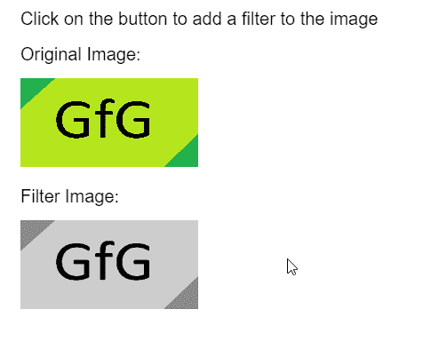
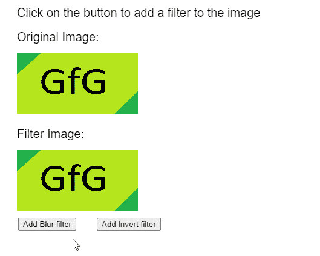

# p5。图像滤波()方法

> 原文:[https://www.geeksforgeeks.org/p5-image-filter-method/](https://www.geeksforgeeks.org/p5-image-filter-method/)

**p5 的**过滤()**方法。JavaScript **p5.js** 库中的图像**用于对图像应用滤镜。在 **p5.js** 中有几个预定义的预设，可以使用不同的强度级别来获得所需的效果。

**语法:**

```
filter( filterType, filterParam )
```

**参数:**该函数接受两个参数，如上所述，如下所述。

*   **过滤器类型:**它是一个常数，定义了用作过滤器的预设。它可以有阈值，灰色，不透明，反转，后化，模糊，侵蚀，扩张或模糊的值。
*   **过滤器参数:**它是每个过滤器独有的数字，影响过滤器的功能。这是一个可选参数。

**注意:**以下示例中使用的 JavaScript 库如下。这些用于任何 HTML 文件的头部。本文底部提供了下载参考链接。

> <脚本 src = " P5 . min . js "></脚本>

**示例 1:** 以下示例说明了 **p5.js** 中的**滤镜()**方法。

## java 描述语言

```
function preload() {
    img_orig =
      loadImage("sample-image.png");
    img_filter =
      loadImage("sample-image.png");
}

function setup() {
    createCanvas(500, 400);
    textSize(20);

    // Draw the original image
    text("Click on the button to " +
      "add a filter to the image", 20, 20);
    text("Original Image:", 20, 60);
    image(img_orig, 20, 80, 200, 100);

    // Apply the GRAYSCALE filter
    img_filter.filter(GRAY);

    // Draw the image with filter
    text("Filter Image:", 20, 220);
    image(img_filter, 20, 240, 200, 100); 
}
```

**输出:**



**例 2:**

## java 描述语言

```
function preload() {
  img_orig =
    loadImage("sample-image.png");
  img_filter =
    loadImage("sample-image.png");
}

function setup() {
  createCanvas(500, 400);
  textSize(20);

  btnBlur = createButton("Add Blur filter");
  btnBlur.position(30, 360);
  btnBlur.mousePressed(applyBlur);

  btnInvert = createButton("Add Invert filter");
  btnInvert.position(160, 360);
  btnInvert.mousePressed(applyInvert);
}

function draw() {
  clear();

  text("Click on the button to add a " +
    "filter to the image", 20, 20);
  text("Original Image:", 20, 60);
  image(img_orig, 20, 80, 200, 100);

  text("Filter Image:", 20, 220);
  image(img_filter, 20, 240, 200, 100); 
}

function applyBlur() {

  // Add the BLUR filter to the image
  img_filter.filter(BLUR, 10);
}

function applyInvert() {

  // Add the INVERT filter to the image
  img_filter.filter(INVERT);
}
```

**输出:**



**在线编辑:**[【https://editor.p5js.org/】](https://editor.p5js.org/)
**环境设置:**[https://www . geeksforgeeks . org/P5-js-soundfile-object-installation-and-methods/](https://www.geeksforgeeks.org/p5-js-soundfile-object-installation-and-methods/)
**参考:**[https://p5js.org/reference/#/p5.Image/filter](https://p5js.org/reference/#/p5.Image/filter)