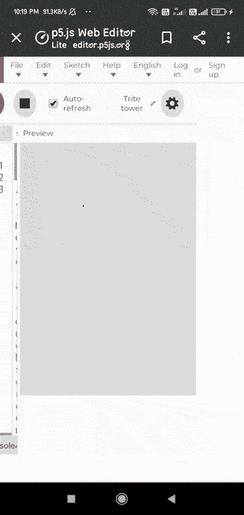

# p5.js 加速 x 变量

> 原文:[https://www.geeksforgeeks.org/p5-js-accelerationx-variable/](https://www.geeksforgeeks.org/p5-js-accelerationx-variable/)

**加速度 X** 系统变量负责设备(平板或手机)沿 x 轴的加速度。它可以与 draw()函数一起使用，在坐标的 x 轴上加速设备。

它的值用米/秒的平方来表示。

**语法:**

```
accelerationX
```

**例 1:**

## java 描述语言

```
// Move a touchscreen device to register
// Acceleration changes.
function setup()
{
  createCanvas(400,400)
}

function draw() {
  background(0, 50);
  fill('green');
  textAlign(CENTER,CENTER);
  textSize(50);

  // Convert the acceleration into integer when
  // device is moved along x axis.
  text(int(accelerationX),windowWidth/2,windowHeight/2);
}
```

**输出:**


**例 2:**

## java 描述语言

```
// Move a touchscreen device to register
// Acceleration changes.
function draw() {
  createCanvas(400,400);
  background(220);
  fill('green');

  // Set the variable.
  ellipse(width / 4, height / 4, accelerationX);
}
```

**输出:**

