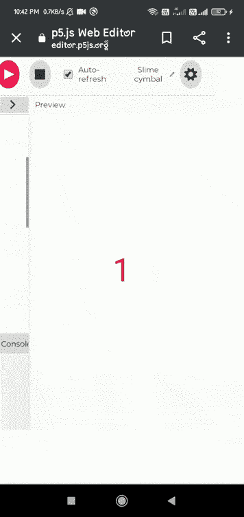

# p5.js 加速变量

> 原文:[https://www.geeksforgeeks.org/p5-js-accelerationy-variable/](https://www.geeksforgeeks.org/p5-js-accelerationy-variable/)

**加速度**系统变量负责设备(平板电脑或手机)沿 y 轴的加速度。它可以与 draw()函数一起使用，在坐标系的 y 轴上加速设备。

它的值用米/秒的平方来表示。

**语法:**

```
accelerationY
```

**例 1:**

## java 描述语言

```
// Move a touchscreen device to register
// Acceleration changes.
function setup()
{
  createCanvas(400,400)
}

function draw() {
  background(270);

  fill('red');
  textAlign(CENTER,CENTER);
  textSize(50);
  // Convert the acceleration into integer when
  // Device is moved along y-axis.
  text(int(accelerationY),windowWidth/2,windowHeight/2);
}
```

**输出:**



**例 2:**

## java 描述语言

```
// Move a touchscreen device to register
// acceleration changes.
function draw() {
  createCanvas(400,400);
  background(220);
  fill('blue');

  //Set the variable.
  square(width/2, height/2, accelerationY);
}
```

**输出:**

