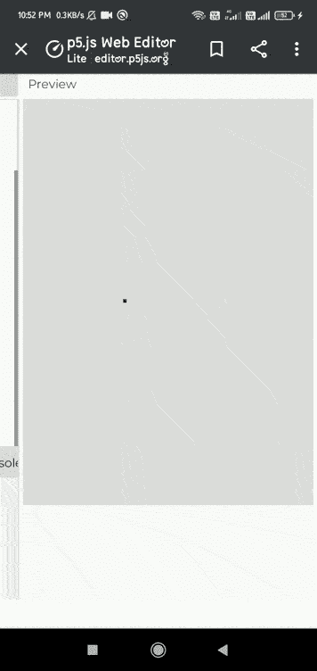

# p5.js 加速 z 变量

> 原文:[https://www.geeksforgeeks.org/p5-js-accelerationz-variable/](https://www.geeksforgeeks.org/p5-js-accelerationz-variable/)

**加速度 Z** 系统变量负责设备(平板电脑或手机)沿 Z 轴的加速度。它可以在 draw()函数中使用，在坐标的 Z 轴上加速设备。

它的值用米/秒的平方来表示。

**语法:**

```
accelerationZ
```

**例 1:**

## java 描述语言

```
// Move a touchscreen device to register
// acceleration changes.
function draw() {
  background(220);
  fill('blue');

  //Set the variable.
  square(width, height, accelerationZ);
}
```

**输出:**



**例 2:**

## java 描述语言

```
// Move a touchscreen device to register
// Acceleration changes.
function setup()
{
  createCanvas(400,400)
}

function draw() {
  background(0, 50);

  fill('green');
  textAlign(CENTER,CENTER);
  textSize(50);

  // Convert the acceleration into integer when
  // device is moved along x axis.
  text(int(accelerationZ),windowWidth/2,windowHeight/2);
}
```

**输出:**


**参考:**T2】https://p5js.org/reference/#/p5/accelerationZ