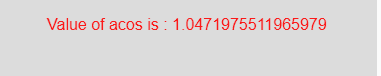

# p5.js | acos()功能

> 原文:[https://www.geeksforgeeks.org/p5-js-acos-function/](https://www.geeksforgeeks.org/p5-js-acos-function/)

p5.js 中的 **acos()函数**用于计算弧余弦值。这个函数的定义域是-1 到+1，范围是 0 到 3.14。

**语法:**

```
acos(c)
```

**参数:**该功能接受单个参数 **c** ，该参数存储-1 到 1 之间的值。

下面的程序说明了 p5.js 中的 acos()函数:

**例 1:** 本例使用 acos()函数计算弧余弦值。

```
function setup() {

    // Create Canvas of size 380*80
    createCanvas(380, 80);
}

function draw() {

    // Set the background color
    background(220);

    // Set the angle in radian
    let angle = PI;

    // Compute value of cos()
    let c = cos(angle);

    // Compute value of acos()
    // It returns the value of PI
    let ac = acos(c);

    // Set the font size
    textSize(16);

    // Set the font color
    fill(color('red'));

    // Display result
    text("Value of acos is : " + ac, 50, 30);
}
```

**输出:**


**例 2:** 本例使用 acos()函数计算弧余弦值。

```
function setup() {

    // Create Canvas of given size
createCanvas(380, 80);
}

function draw() {

    // Set the background color
    background(220);

    let c = 0.5;

    // Use acos() function to calculate
    // arc cosine value
    let ac = acos(c);

    // Set font size
    textSize(16);

    // Set font color
    fill(color('red'));

    // Display result
    text("Value of acos is : " + ac, 50, 30);
}
```

**输出:**


**参考:**T2】https://p5js.org/reference/#/p5/acos