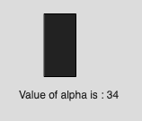

# p5.js | alpha()功能

> 原文:[https://www.geeksforgeeks.org/p5-js-alpha-function/](https://www.geeksforgeeks.org/p5-js-alpha-function/)

p5.js 中的 **alpha()函数**用于*从颜色或像素阵列*中提取 alpha 值。

**语法:**

```
alpha(c)

```

**参数:**该功能接受如上所述的单个参数，描述如下:

*   **c** : This parameter stores the p5.Color object, color components, or CSS color.

    下面的程序说明了【p5.js:
    **中的 **alpha()函数**示例-1:**

    ```
    function setup() {

        //create Canvas of size 300*80  
        createCanvas(300, 80);
    }

    function draw() {
        background(220);

        //initialize the parameter  
        let c = color(0, 126, 255, 102);

        //extract the alpha value
        let y = alpha(c);
        textSize(16);
        fill(color('red'));
        text("Alpha Value is : " + y, 50, 30);
    }
    ```

    **输出:**
    

    **示例-2:**

    ```
    function setup() {

        //create Canvas of size 300*80  
        createCanvas(160, 180);
    }

    function draw() {
        background(220);

        //initialize the parameter  
        let c = color(0, 126, 255, 34);

        // Sets 'value' to 34
        let value = alpha(c);
        fill(value);
        rect(50, 15, 35, 70);
        text("Value of alpha is : " + value, 22, 110);
    }
    ```

    **输出:**
    
    **参考:**[https://p5js.org/reference/#/p5/alpha](https://p5js.org/reference/#/p5/alpha)