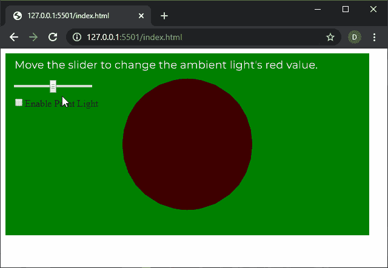
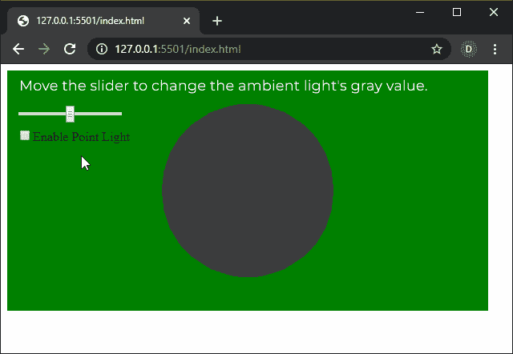

# p5.js | ambientLight()功能

> 原文:[https://www.geeksforgeeks.org/p5-js-ambientlight-function/](https://www.geeksforgeeks.org/p5-js-ambientlight-function/)

p5.js 中的 **ambientLight()功能**用于创建指定颜色的环境光。环境光没有任何特定的光源。它来自画布的任何地方，均匀地照亮物体。

**语法:**

```
ambientLight( v1, v2, v3, [alpha] )
```

运筹学

```
ambientLight( value )
```

运筹学

```
ambientLight( gray, [alpha] )
```

运筹学

```
ambientLight( values )
```

运筹学

```
ambientLight( color )
```

**参数:**该函数接受八个参数，如上所述，如下所述:

*   **v1:** 是决定相对于当前颜色范围的红色或色相值的数字。
*   **v2:** 是决定相对于当前颜色范围的绿色或饱和度值的数字。
*   **v3:** 是决定相对于当前颜色范围的蓝色或亮度值的数字。
*   **alpha:** 是决定颜色 alpha 值的数字。
*   **值:**是定义环境光颜色的字符串。
*   **灰度:**是定义环境光灰度值的数字。
*   **值:**它是一组数字，定义了环境光颜色的红色、绿色、蓝色和阿尔法分量。
*   **颜色:**是 p5。定义环境光颜色的颜色。

下面的例子说明了 p5.js 中的 **ambientLight()函数**:

**例 1:**

```
let newFont;
let pointLightEnable = false;

function preload() {
  newFont = loadFont('fonts/Montserrat.otf');
}

function setup() {
  createCanvas(600, 300, WEBGL);
  textFont(newFont, 18);

  graySlider = createSlider(0, 128, 64, 1);
  graySlider.position(20, 50);

  pointLightCheck = createCheckbox(
       "Enable Point Light", false);

  pointLightCheck.position(20, 80);

  // Toggle point light
  pointLightCheck.changed(() => {
    pointLightEnable = !pointLightEnable;
  });
}

function draw() {
  background("green");
  text("Move the slider to change the ambient"
        + " light's red value.", -285, -125);
  noStroke();
  shininess(15);
  if (pointLightEnable) {
    pointLight(0, 0, 255, -width / 2,
                    -height / 2, 250);
  }

  grayValue = graySlider.value();
  ambientLight(grayValue, 0, 0);
  specularMaterial(250);
  sphere(100);
}
```

**输出:**


**例 2:**

```
let newFont;
let pointLightEnable = false;

function preload() {
  newFont = loadFont('fonts/Montserrat.otf');
}

function setup() {
  createCanvas(600, 300, WEBGL);
  textFont(newFont, 18);

  graySlider = createSlider(0, 128, 64, 1);
  graySlider.position(20, 50);

  pointLightCheck = createCheckbox(
        "Enable Point Light", false);

  pointLightCheck.position(20, 80);

  // Toggle point light
  pointLightCheck.changed(() => {
    pointLightEnable = !pointLightEnable;
  });
}

function draw() {
  background("green");
  text("Move the slider to change the ambient"
      + " light's gray value.", -285, -125);
  noStroke();
  shininess(15);
  if (pointLightEnable) {
    pointLight(255, 0, 0, -width / 2,
                    -height / 2, 250);
  }

  grayValue = graySlider.value();
  ambientLight(grayValue);
  specularMaterial(250);
  sphere(100);
}
```

**输出:**


**在线编辑:**[https://editor.p5js.org/](https://editor.p5js.org/)

**环境设置:**

**参考:**T2】https://p5js.org/reference/#/p5/ambientLight