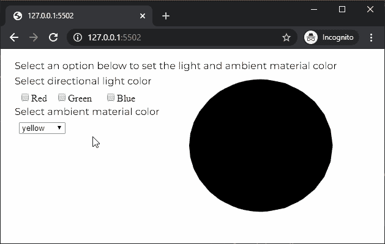

# p5.js | ambientMaterial()函数

> 原文:[https://www . geesforgeks . org/P5-js-ambient material-function/](https://www.geeksforgeeks.org/p5-js-ambientmaterial-function/)

p5.js 中的**环境材质()函数**用于为给定颜色的几何图形创建环境材质。环境材质用于定义对象在任何光线下反射的颜色。如果环境材质设置为仅反射红色，而灯光仅反射蓝色，则对象不会反射任何光线。

**语法:**

```
ambientMaterial( v1, [v2], [v3] )
```

运筹学

```
ambientMaterial( color )
```

**参数:**该函数接受四个参数，如上所述，如下所述:

*   **v1:** 是决定灰度值，或者相对于当前颜色范围的红色或色相值的数字。
*   **v2:** 是决定相对于当前颜色范围的绿色或饱和度值的数字。这是一个可选参数。
*   **v3:** 是决定相对于当前颜色范围的蓝色或亮度值的数字。这是一个可选参数。
*   **颜色:**是 p5。定义环境材质颜色的颜色或颜色字符串。

下面的例子说明了 p5.js 中的 **ambientMaterial()函数**:

**例 1:**

```
let newFont;
let currentLightColor = "red";
let currentAmbientColor = "red";

function preload() {
  newFont = loadFont('fonts/Montserrat.otf');
}

function setup() {
  createCanvas(600, 300, WEBGL);
  textFont(newFont, 16);

  // Create a selector for selecting
  // the ambient material color
  materialColorSel = createSelect();
  materialColorSel.position(30, 70);
  materialColorSel.option('red');
  materialColorSel.option('green');
  materialColorSel.option('blue');
  materialColorSel.changed(() => {
    currentLightColor = materialColorSel.value();
  });

  // Create a selector for selecting
  // the directional light color
  lightColorSel = createSelect();
  lightColorSel.position(30, 120);
  lightColorSel.option('red');
  lightColorSel.option('green');
  lightColorSel.option('blue');
  lightColorSel.changed(() => {
    currentAmbientColor = lightColorSel.value();
  });
}

function draw() {
  background('white');
  fill('black');

  text("Select an option below to set the light "
        + "and ambient material color", -285, -125);
  text("Select directional light color", -285, -100);
  text("Select ambient material color", -285, -50);
  shininess(10);
  noStroke();

  // Set the ambient material to the selected color
  ambientMaterial(currentAmbientColor);

  // Set the directional to the selected color
  directionalLight(color(currentLightColor), 
               height / 2, width / 2, -250);

  // Draw the sphere
  translate(100, 0, 0);
  sphere(100);
  translate(-100, 0, 0);
}
```

**输出:**


**例 2:**

```
let newFont;
let currentLightColor = "yellow";
let hasRed = false;
let hasGreen = false;
let hasBlue = false;

function preload() {
  newFont = loadFont('fonts/Montserrat.otf');
}

function setup() {
  createCanvas(600, 300, WEBGL);
  textFont(newFont, 16);

  // Create 3 checkboxes for mixing 3 colors
  redCheckbox = createCheckbox('Red', false);
  redCheckbox.position(30, 70);
  redCheckbox.changed(() => hasRed = !hasRed);

  greenCheckbox = createCheckbox('Green', false);
  greenCheckbox.position(90, 70);
  greenCheckbox.changed(() => hasGreen = !hasGreen);

  blueCheckbox = createCheckbox('Blue', false);
  blueCheckbox.position(170, 70);
  blueCheckbox.changed(() => hasBlue = !hasBlue);

  // Create a selector for selecting
  // the directional light color
  lightColorSel = createSelect();
  lightColorSel.position(30, 120);
  lightColorSel.option('yellow');
  lightColorSel.option('magenta');
  lightColorSel.option('cyan');
  lightColorSel.changed(() => {
    currentLightColor = lightColorSel.value();
  });
}

function draw() {
  background('white');
  fill('black');

  text("Select an option below to set the light "
      + "and ambient material color", -285, -125);
  text("Select directional light color", -285, -100);
  text("Select ambient material color", -285, -50);
  shininess(10);
  noStroke();

  // Define the color based on the checkboxes
  let currentAmbientColor = color(hasRed ? 255 : 0,
            hasGreen ? 255 : 0, hasBlue ? 255 : 0);

  // Set the ambient material to the defined color
  ambientMaterial(currentAmbientColor);

  // Set the directional to the selected color
  directionalLight(color(currentLightColor),
              height / 2, width / 2, -250);

  // Draw the sphere
  translate(100, 0, 0);
  sphere(100);
  translate(-100, 0, 0);
}
```

**输出:**


**在线编辑:**[https://editor.p5js.org/](https://editor.p5js.org/)

**环境设置:**

**参考:**T2】https://p5js.org/reference/#/p5/ambientMaterial