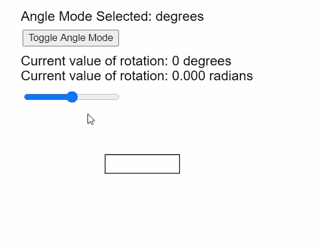

# p5.js | angleMode()功能

> 原文:[https://www.geeksforgeeks.org/p5-js-anglemode-function/](https://www.geeksforgeeks.org/p5-js-anglemode-function/)

p5.js 中的**角度模式()功能**用于设置角度解释的模式。它可以设置为角度或弧度。所有使用角度作为参数的函数都将遵循该函数设置的角度模式。

**语法:**

```
angleMode( mode )

```

**参数:**该函数接受如上所述的单个参数，如下所述:

*   **模式:**这是一个常数，可用于设置角度解释的模式。它可以有 DEVELOPES 或 RADIANS 值。

以下示例说明了 p5.js:
**示例:**中的 **angleMode()函数**

## java 描述语言

```
let angleModeSelected;

function setup() {
  createCanvas(400, 300);
  textSize(18);

  // Set the default angle to DEGREES
  angleModeSelected = DEGREES;

  // Create a button for toggling the angle mode
  angleModeToggler = createButton("Toggle Angle Mode");
  angleModeToggler.position(30, 40);
  angleModeToggler.mouseClicked(() => {
    if (angleModeSelected == DEGREES) angleModeSelected = RADIANS;
    else angleModeSelected = DEGREES;
  });

  // Create a slider for changing the current angle
  angleSlider = createSlider(-180, 180, 0, 1);
  angleSlider.position(30, 120);
}

function draw() {
  clear();

  // Get the angle from the slider
  let angleToRotate = angleSlider.value();

  // Convert the angle to radians
  // for demonstration
  let angleInRadians = (angleToRotate / 57.295).toFixed(3);

  text("Angle Mode Selected: " + angleModeSelected, 20, 20);
  text("Current value of rotation: " + angleToRotate + " degrees", 20, 80);
  text("Current value of rotation: " + angleInRadians + " radians", 20, 100);

  // Set the angle mode
  // based on the selected mode
  angleMode(angleModeSelected);

  translate(width / 3, height / 1.5);

  // Rotate the shape according to
  // the angle specified
  rotate(angleToRotate);

  // Draw the rectangle that
  // would be rotated
  rect(0, 0, 100, 25);
}
```

**输出:**



**在线编辑:**[【https://editor.p5js.org/】](https://editor.p5js.org/)
**环境设置:**[https://www . geeksforgeeks . org/P5-js-soundfile-object-installation-and-methods/](https://www.geeksforgeeks.org/p5-js-soundfile-object-installation-and-methods/)
**参考:**[https://p5js.org/reference/#/p5/angleMode](https://p5js.org/reference/#/p5/angleMode)