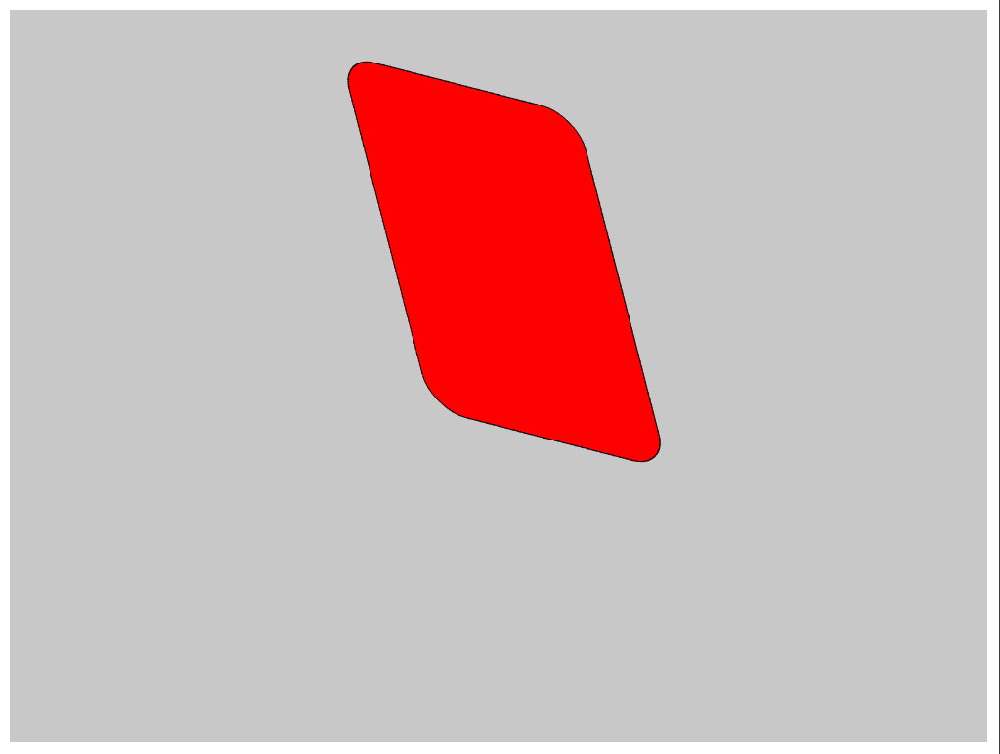
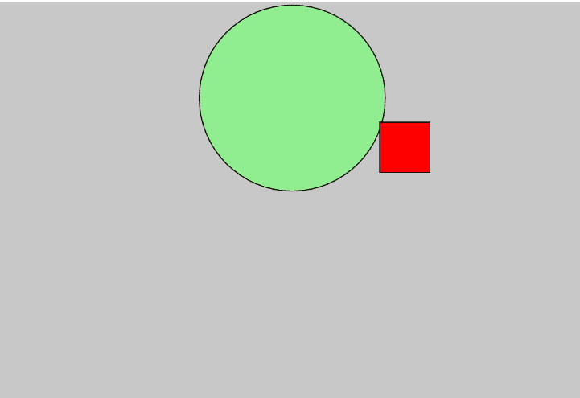
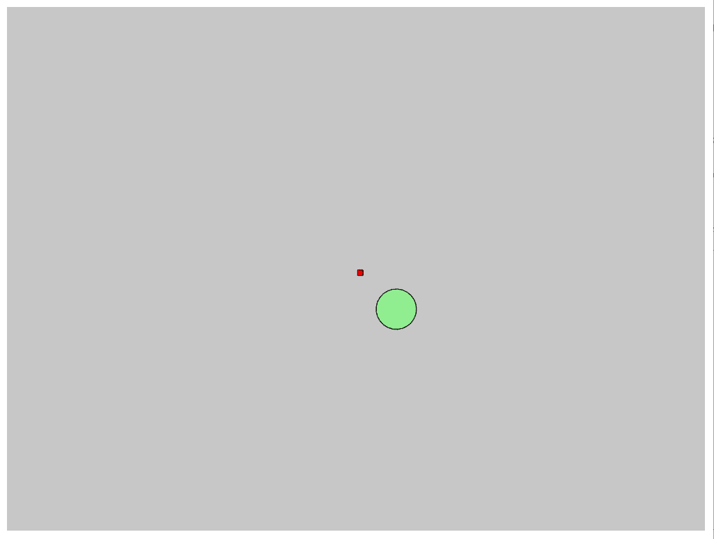
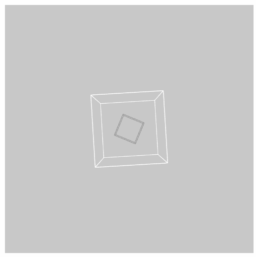

# p5.js applyMatrix()函数

> 原文:[https://www.geeksforgeeks.org/p5-js-applymatrix-function/](https://www.geeksforgeeks.org/p5-js-applymatrix-function/)

p5.js 中的 **applyMatrix()** 函数用于将作为参数给出的矩阵与当前矩阵相乘。这可用于同时执行平移、缩放、剪切和旋转操作。这是一个强大的操作，可以用来轻松操纵场景中的对象。

**语法:**

```
applyMatrix(a, b, c, d, e, f)
```

**参数:**该方法有 6 个参数，如上所述，描述如下:

*   **a:** 是定义要相乘的 2×3 矩阵的数字。
*   **b:** 是定义要相乘的 2×3 矩阵的数字。
*   **c:** 是定义要相乘的 2×3 矩阵的数字。
*   **d:** 是定义要相乘的 2×3 矩阵的数字。
*   **e:** 是定义要相乘的 2×3 矩阵的数字。
*   **f:** 是定义要相乘的 2×3 矩阵的数字。

以下示例演示了 p5.js 中的 **applyMatrix()** 函数:

**示例 1:** 在本例中，矩阵用于将矩形旋转某个角度。

## java 描述语言

```
function setup() {
  createCanvas(800, 600);
}

function draw() {

  let step = frameCount % 50;

  // Calculate the angle and the 
  // sin and cos values
  let angle = map(step, 10, 60, 0, PI);
  let cos_a = cos(angle);
  let sin_a = sin(angle);

  // Set the background colour
  background(200);

  // Translate the elements
  translate(500, 50);

  // Use applyMatrix() to multiply using
  // the given values
  applyMatrix(cos_a, sin_a,
                -sin_a, -cos_a,
              0, 0);

  // Set the colour to fill the graphics
  fill("red");

  // Set the shape
  rect(50, 50, 300, 200, 30);
}
```

**输出:**



**示例 2:** 在该示例中，矩阵用于翻译 2D 图像。

## java 描述语言

```
function setup() {

  // Create canvas
  createCanvas(800, 600);

  // Set the frame rate
  frameRate(20);
}

function draw() {

  let step1 = frameCount % 15;
  let step2 = frameCount % 50;

  fill('lightgreen');
  background(200);

  // Apply matrix transform equivalent
  // to translate(x, y)
  applyMatrix(1, 0, 0, 1, 300 + step1, 50);

  // Set a shape to be used
  ellipse(56, 46, 185, 185);

  fill('red');

  // Apply matrix transform equivalent
  // to translate(x, y)
  applyMatrix(1, 0, 0, 1, 100 + step2, 50);

  // Set the shape to be used
  rect(30, 20, 50, 50);
}
```

**输出:**



**示例 3:** 在该示例中，矩阵用于缩放 2D 图像。

## java 描述语言

```
function setup() {
  // Create canvas
  createCanvas(800, 600, WEBGL);

  // Set the frame rate
  frameRate(20);
}

function draw() {
  let step1 = frameCount % 10;
  let step2 = frameCount % 20;

  fill("lightgreen");
  background(200);

  // Apply matrix transformation 
  // equivalent to translate(x, y)
  applyMatrix(1 / step1, 0, 0, 1 / step1, 0, 0);

  // Set the shape to be used
  ellipse(185, 185, 185, 185);

  fill("red");

  // Apply matrix transformation 
  // equivalent to scale(x, y)
  applyMatrix(1 / step2, 0, 0, 1 / step2, 0, 1 / step2);

  // Set the shape to be used
  rect(30, 20, 100, 100);
}
```

**输出:**



**示例 4:** 在本例中，矩阵用于旋转图形。

## java 描述语言

```
function setup() {
  createCanvas(400, 400, WEBGL);
  noFill();
}

function draw() {
  background(200);

  // Rotate the box
  rotateX(PI / 2);
  rotateY(PI / 8);

  stroke(153);
  box(35);

  let rad = millis() / 500;

  // Set rotation angle
  let ct = cos(rad);
  let st = sin(rad);

  // Apply matrix for rotation 
  applyMatrix(  ct, 0.0,  st,  0.0,
               0.0, 1.0, 0.0,  0.0,
               -st, 0.0,  ct,  0.0,
               0.0, 0.0, 0.0,  1.0);

  stroke(255);
  box(100);
}
```

**输出:**

