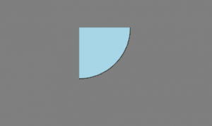
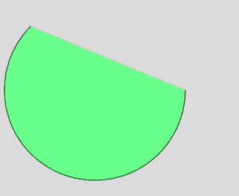
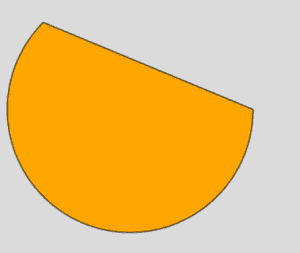
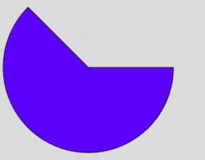

# p5.js | arc()功能

> 原文:[https://www.geeksforgeeks.org/p5-js-arc-function/](https://www.geeksforgeeks.org/p5-js-arc-function/)

arc()函数是 p5.js 中的一个内置函数，用于绘制圆弧。该功能接受七个参数，即 x 坐标、y 坐标、宽度、高度、起点、终点和可选参数模式。

**语法:**

```
arc(x, y, w, h, start, stop, mode)
```

**参数:**该功能接受 7 个参数，如上所述，描述如下:

*   **x:** 此参数用于保存椭圆弧的 x 坐标值。
*   **y:** 此参数用于保存椭圆弧的 y 坐标值。
*   **w:** 此参数取椭圆弧的宽度值。
*   **h:** 此参数取椭圆弧的高度值。
*   **开始:**该参数取圆弧开始的角度值，以弧度表示。
*   **停止:**此参数取角度值来停止圆弧，以弧度指定。
*   **模式:**这是一个可选参数，它决定了弧线的绘制方式，可以是*弦、PIE 或打开*

*   **Program 1:** This program uses the DEFAULT mode.

    ```
    function setup() {
        createCanvas(400, 400);
    }

    function draw() {
        background('gray');

        // Quarter arc at 150, 55 of height and width 290px
        arc(150, 55, 290, 290, 0, HALF_PI); 
        fill('lightblue');
    }
    ```

    **输出:**
    

*   **Program 2:** This program uses the OPEN mode.

    ```
    function setup() {
        createCanvas(400, 400);
    }

    function draw() {
        background(220);
        fill('lightgreen');

        // An open arc at 150, 150 with radius 280
        arc(150, 150, 280, 280, 0, PI + QUARTER_PI, OPEN); 
    }
    ```

    **输出:**
    

*   **Program 3:** This program uses the CHORD mode.

    ```
    function setup() {
        createCanvas(400, 400);
    }

    function draw() {
        background(220);
        fill('orange');

        // A chord-arc at 150, 150 with radius 280
        arc(150, 150, 280, 280, 0, PI + QUARTER_PI, CHORD); 
    } 
    ```

    **输出:**
    

*   **Program 4:** This program uses PIE mode.

    ```
    function setup() {
        createCanvas(400, 400);
    }

    function draw() {
        background(220);
        fill('blue');

        // A pie-arc at 150, 150 with radius 280
        arc(150, 150, 280, 280, 0, PI + QUARTER_PI, PIE); 
    } 
    ```

    **输出:**
    

**参考文献:**T2】https://p5js.org/reference/#/p5/arc