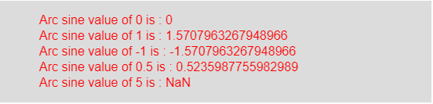

# p5.js | asin()功能

> 原文:[https://www.geeksforgeeks.org/p5-js-asin-function/](https://www.geeksforgeeks.org/p5-js-asin-function/)

p5.js 中的 **asin()函数**用于计算正弦(反正弦)的倒数。如果输入值范围为-1 到 1，则它返回-π/2 到π/2 之间的范围。

**语法:**

```
asin(value)
```

**参数:**该函数接受单个参数**值**，该值存储 asin()函数的定义域。

**返回值:**返回给定值的反正弦。

下面的程序说明了 p5.js 中的 asin()函数:

**示例:**本示例使用 asin()函数获取一个值的反正弦。

```
function setup() { 

    // Create Canvas of given size
    createCanvas(550, 130); 
} 

function draw() { 

    // Set the background color 
    background(220); 

    // Initialize the parameter
    // with some values
    let a = 0; 
    let b = 1; 
    let c = -1;
    let d = 0.5;
    let e = 5;

    // Call to asin() function 
    let v = asin(a);
    let w = asin(b);
    let x = asin(c);
    let y = asin(d);
    let z = asin(e);

    // Set the size of text 
    textSize(16); 

    // Set the text color 
    fill(color('red')); 

    // Getting arc sine value 
    text("Arc sine value of 0 is : " + v, 50, 30);
    text("Arc sine value of 1 is : " + w, 50, 50);
    text("Arc sine value of -1 is : " + x, 50, 70);
    text("Arc sine value of 0.5 is : " + y, 50, 90);
    text("Arc sine value of 5 is : " + z, 50, 110);     
} 
```

**输出:**


**注意:**如果值大于 1 或小于-1，则返回 NaN。

**参考:**T2】https://p5js.org/reference/#/p5/asin