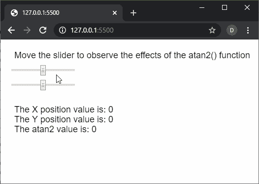
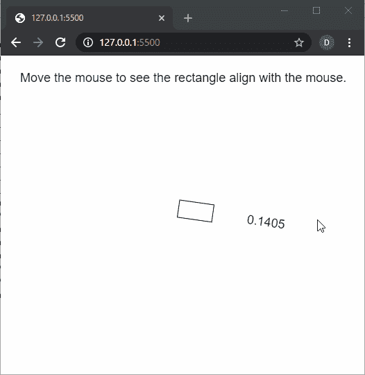

# p5.js | atan2()功能

> 原文:[https://www.geeksforgeeks.org/p5-js-atan2-function/](https://www.geeksforgeeks.org/p5-js-atan2-function/)

p5.js 中的 **atan2()函数**用于计算从正 x 轴测量的指定原点的角度。这些值作为浮点值在π到π的范围内返回。它通常用于将几何图形定向到光标位置。

**语法:**

```
atan2(y, x)
```

**参数:**该函数接受两个参数，如上所述，如下所述。

*   **y:** 是指定点的 y 坐标的数字。
*   **x:** 是指定点的 x 坐标的数字。

**返回值:**返回一个数字，表示给定点的反正切。

下面的例子说明了 p5.js 中的 **atan2()函数**:

**例 1:**

```
function setup() {
  createCanvas(500, 200);
  textSize(18);

  text("Move the slider to observe the effects"
         + " of the atan2() function", 20, 30);

  sliderXPos = createSlider(-200, 200, 0, 1);
  sliderXPos.position(20, 50);

  sliderYPos = createSlider(-200, 200, 0, 1);
  sliderYPos.position(20, 80);
}

function draw() {
  clear();
  text("Move the slider to observe the effects"
         + " of the atan2() function", 20, 30);

  sliderXVal = sliderXPos.value();
  sliderYVal = sliderYPos.value();

  atan2Val = atan2(sliderXVal, sliderYVal);

  text("The X position value is: " + sliderXVal, 20, 140);
  text("The Y position value is: " + sliderYVal, 20, 160);
  text("The atan2 value is: " + atan2Val, 20, 180);
}
```

**输出:**


**例 2:**

```
function setup() {
  createCanvas(500, 400);
  textSize(18);

  text("Move the mouse to see the rectangle"
        + " align to it.", 20, 30);
}

function draw() {
  clear();
  text("Move the mouse to see the rectangle"
        + " align with the mouse.", 20, 30);

  // Move the rectangle to the
  // middle of the screen
  translate(width / 2, height / 2);

  // Use the atan2() function to find
  // the value according to the mouse
  // coordinates
  let adjustedValue = atan2(mouseY - height / 2,
                            mouseX - width / 2);
  rotate(adjustedValue);

  // Draw a rectangle
  rect(0, 0, 50, 25);

  text(adjustedValue.toFixed(4), 100, 20);
}
```

**输出:**


**在线编辑:**[https://editor.p5js.org/](https://editor.p5js.org/)

**环境设置:**

**参考:**T2】https://p5js.org/reference/#/p5/atan2