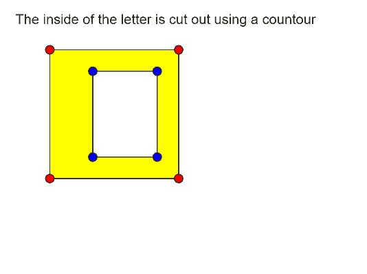
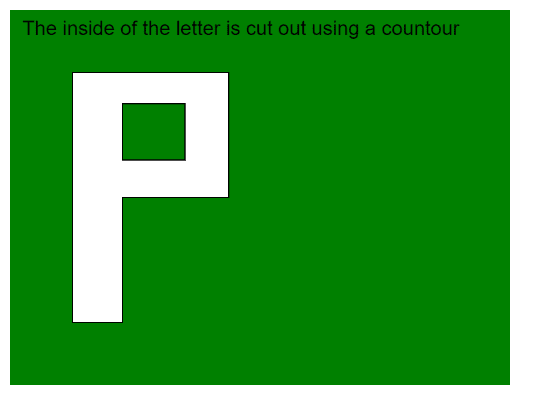

# p5.js | beginContour()函数

> 原文:[https://www.geeksforgeeks.org/p5-js-begincontour-function/](https://www.geeksforgeeks.org/p5-js-begincontour-function/)

p5.js 中的 **beginContour()函数**用于在其他形状中创建负形状，也就是说，它可以用于移除具有给定顶点的形状的一部分。此功能开始记录必须移除的形状。它与停止记录顶点的**结束轮廓()**功能一起使用。

内部形状的顶点必须定义在与外部形状相反的方向上。如果外部形状的顶点是按顺时针顺序定义的，那么内部形状必须按逆时针方向定义。

该功能只能在 **beginShape()** 或 **endShape()** 功能中使用。像**平移()**、**旋转()**和**缩放()**这样的变换不适用于形状和轮廓。

**语法:**

```
beginContour()
```

**参数:**此功能不接受参数。

下面的程序说明了 p5.js 中的**begin cour()**函数:

**例 1:**

```
function setup() {
  createCanvas(400, 300);
  textSize(16);
}

function draw() {
  clear();
  fill("black");
  text("The inside of the letter is cut"+
       " out using a countour", 10, 20);
  fill("yellow");

  // Starting the shape using beginShape()
  beginShape();

  // Specifying all the vertices
  // of the exterior shape
  vertex(50, 50);
  vertex(200, 50);
  vertex(200, 200);
  vertex(50, 200);

  // Starting a contour
  beginContour();

  // Specifying all the vertices
  // of the interior shape
  // in counter-clockwise order
  vertex(100, 175);
  vertex(175, 175);
  vertex(175, 75);
  vertex(100, 75);

  // Ending the contour
  endContour();

  // Ending the shape
  endShape(CLOSE);

  // Draw Circles for demonstration
  // Red ones for exterior shape
  fill("red");
  circle(50, 50, 10);
  circle(200, 50, 10);
  circle(200, 200, 10);
  circle(50, 200, 10);

  fill("blue");
  // Blue ones for interior shape
  circle(100, 175, 10);
  circle(175, 175, 10);
  circle(175, 75, 10);
  circle(100, 75, 10);
}
```

**输出:**



**例 2:**

```
function setup() {
  createCanvas(400, 300);
  textSize(16);
}

function draw() {
  clear();
  background("green");
  text("The inside of the letter is cut out"+
       " using a countour", 10, 20);

  // Starting the shape using beginShape()
  beginShape();

  // Specifying all the vertices
  // of the exterior shape
  vertex(50, 250);
  vertex(50, 50);
  vertex(175, 50);
  vertex(175, 150);
  vertex(90, 150);
  vertex(90, 250);

  // Starting a contour
  beginContour();

  // Specifying all the vertices
  // of the interior shape
  // in counter-clockwise order
  vertex(90, 120);
  vertex(140, 120);
  vertex(140, 75);
  vertex(90, 75);

  // Ending the contour
  endContour();

  // Ending the shape
  endShape(CLOSE);
}
```

**输出:**


**在线编辑:**[【https://editor.p5js.org/】](https://editor.p5js.org/)
**环境设置:**[https://www . geeksforgeeks . org/P5-js-soundfile-object-installation-and-methods/](https://www.geeksforgeeks.org/p5-js-soundfile-object-installation-and-methods/)

**参考:**T2】https://p5js.org/reference/#/p5/beginContour