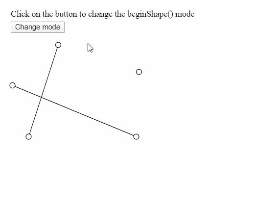
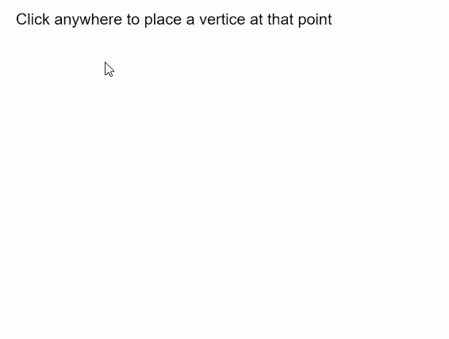

# p5.js | beginShape()函数

> 原文:[https://www.geeksforgeeks.org/p5-js-beginshape-function/](https://www.geeksforgeeks.org/p5-js-beginshape-function/)

p5.js 中的 **beginShape()函数**用于绘制更复杂的形状。指定此函数将开始记录用于绘制形状的顶点。必须调用 **endShape()** 函数来结束记录并完成形状。

调用 **beginShape()** 函数后，应使用 **vertex()** 命令指定一系列顶点。使用当前描边颜色勾勒形状轮廓，并用当前填充颜色填充。有一个可选参数可以定义为使用要绘制的形状类型。

绘制的形状不适用于变换功能，如**平移()**、**旋转()**和**缩放()**。此外，不能使用带有 **beginShape()** 的其他形状。

**语法:**

```
beginShape( [kind] )
```

**参数:**该函数接受一个参数，如上所述，如下所述:

*   **种类:**是一个常数，可以用来改变这个函数所绘制的形状的种类。它可以有点、线、三角形、三角形 _ 扇形、三角形 _ 带状、四边形、四边形 _ 带状或三角形 _ 带状的值。这是一个可选参数。

下面的例子说明了 p5.js 中的 **beginShape()函数**:

**例 1:**

```
let currMode;

function setup() {
  createCanvas(500, 300);
  textSize(18);

  let shapeModes = [LINES, TRIANGLES, TRIANGLE_FAN, TRIANGLE_STRIP, QUADS];
  let index = 0;
  currMode = shapeModes[index];

  let helpText = createP("Click on the button to change the beginShape() mode");
  helpText.position(20, 0);

  let closeBtn = createButton("Change mode");
  closeBtn.position(20, 40);
  closeBtn.mouseClicked(() => {
    if (index < shapeModes.length) index++;
    else index = 0;
    currMode = shapeModes[index];
  });
}

function draw() {
  clear();

  // Starting the shape using beginShape()
  beginShape(currMode);

  // Specifying all the vertices
  vertex(45, 245);
  vertex(100, 75);
  vertex(245, 245);
  vertex(15, 150);
  vertex(250, 125);

  // Ending the shape using endShape()
  endShape();

  // Points for demonstration
  circle(45, 245, 10);
  circle(100, 75, 10);
  circle(245, 245, 10);
  circle(15, 150, 10);
  circle(250, 125, 10);
}
```

**输出:**



**例 2:**

```
let vertices = [];

function setup() {
  createCanvas(500, 300);
  textSize(18);

  text("Click anywhere to place a vertice at that point", 10, 20);
}

function mouseClicked() {
  // Update the vertices array with
  // current mouse position
  vertices.push({ x: mouseX, y: mouseY });

  clear();
  text("Click anywhere to place a vertice at that point", 10, 20);

  // Start the shape using beginShape()
  beginShape();

  // Use the vertices in the array
  // with the vertex() function
  for (let i = 0; i < vertices.length; i++)
    vertex(vertices[i].x, vertices[i].y);

  // End the shape using endShape()
  endShape();

  // Draw a circle at the last drawn vertice
  // for demonstration
  circle(mouseX, mouseY, 15);
}
```

**输出:**



**在线编辑:**[https://editor.p5js.org/](https://editor.p5js.org/)

**环境设置:**

**参考:**T2】https://p5js.org/reference/#/p5/beginShape