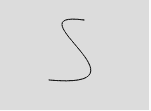
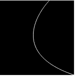

# p5.js | bezier()函数

> 原文:[https://www.geeksforgeeks.org/p5-js-bezier-function/](https://www.geeksforgeeks.org/p5-js-bezier-function/)

p5.js 中的 bezier()函数用于在屏幕上绘制三次 Bezier 曲线。这些曲线由一系列锚点和控制点定义。

**语法:**

```
bezier( x1, y1, x2, y2, x3, y3, x4, y4 )
or
bezier( x1, y1, z1, x2, y2, z2, x3, y3, z3, x4, y4, z4 )

```

**参数:**该功能接受如上所述的十二个参数，如下所述:

*   **x1** 该参数存储第一个锚点的 x 坐标*   **y1** 该参数存储第一个锚点的 y 坐标*   **x2** 该参数存储第一个控制点的 x 坐标*   **y2** 该参数存储第一个控制点的 y 坐标*   **x3** 该参数存储第二个控制点的 x 坐标*   **y3** 该参数存储第二个控制点的 y 坐标*   **x4** 该参数存储第二个锚点的 x 坐标*   **y4** 该参数存储第二个锚点的 y 坐标*   **z1** 该参数存储第一个锚点的 z 坐标*   **z2** 该参数存储第一个控制点的 z 坐标*   **z3** 该参数存储第二个控制点的 z 坐标*   **z4** This parameter stores z-coordinate for the second anchor point

    下面的程序说明了 p5.js 中的 bezier()函数:

    **示例 1:** 本示例使用 bezier()函数绘制 bezier()曲线。

    ```
    function setup() {

        // Create canvas size 
        createCanvas(150, 110);
    }

    function draw() {

        // Set the background color
        background(220);

        noFill();

        // Set the stroke color
        stroke(0, 0, 0);

        // Bezier function 8 parameters 
        // except z-coordinate
        bezier(85, 20, 10, 10, 160, 90, 50, 80);
    }
    ```

    

    **示例 2:** 本示例使用 bezier()函数，用所有参数绘制一条 bezier()曲线。

    ```
    function setup() {

        // Create canvas size
        createCanvas(150, 150);
    }

    function draw() {

        // Set the background color
        background(0, 0, 0);

        noFill();

        // Set the stroke color
        stroke(255);

        // Bezier function with all 12 parameters
        bezier(150, 150, 0, 100, 100, 0, 100, 0, 0, 0, 100, 0);
    }
    ```

    

    **参考:**T2】https://p5js.org/reference/#/p5/bezier