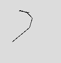
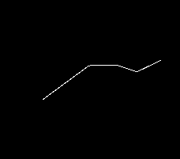

# P5 . js | bezierdeail()功能

> 原文:[https://www.geeksforgeeks.org/p5-js-bezierdetail-function/](https://www.geeksforgeeks.org/p5-js-bezierdetail-function/)

p5.js 中的 bezierDetail()函数用于设置 Beziers 显示的分辨率。为了使用它，我们必须使用 WEBGL 渲染参数。

**语法:**

```
bezierDetail( detail )

```

**参数:**该功能接受存储曲线分辨率的单参数**细节**。

下面的程序说明了 p5.js 中的 bezierDetail()函数:

**示例 1:** 本示例使用 bezierDetail()函数设置 Beziers 显示的分辨率。

```
function setup() {

    // Create canvas size
    createCanvas(450, 310, WEBGL);

    // bezierDetail() function
    bezierDetail(6);
}

function draw() {

    // Set the background color
    background(220);
    noFill();

    // Bezier function with 8 parameters 
    // except z-coordinate
    bezier(85, 20, 10, 10, 160, 90, 50, 80);
}
```

**输出:**


**示例 2:** 本示例使用 bezierDetail()函数设置 Beziers 显示的分辨率。

```
function setup() {

    // Create canvas of given size
    createCanvas(350, 350, WEBGL);

    // Use bezierDetail function
    bezierDetail(4);
}

function draw() {

    // Set background color
    background(0, 0, 0);

    noFill();

    // Set stroke color
    stroke(255);

    // Draw bezier curve
    bezier(150, 50, 0, 100, 100, 0, 100, 0, 0, 0, 100, 0);
}
```

**输出:**


**参考:**T2】https://p5js.org/reference/#/p5/bezierDetail