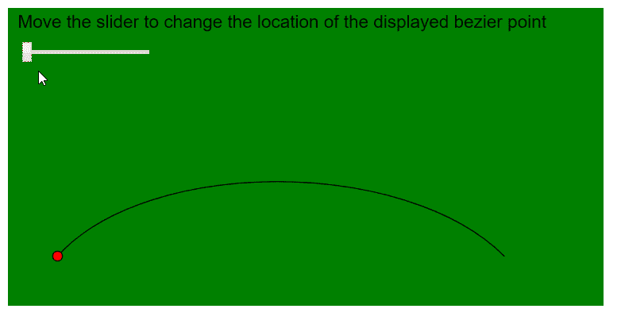
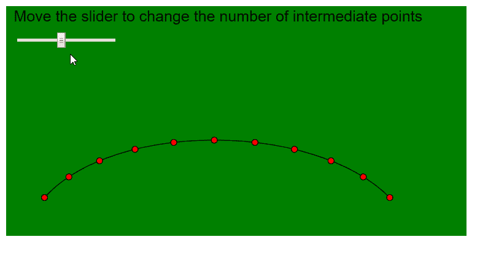

# p5.js | bezierPoint()函数

> 原文:[https://www.geeksforgeeks.org/p5-js-bezierpoint-function/](https://www.geeksforgeeks.org/p5-js-bezierpoint-function/)

p5.js 中的 **bezierPoint()函数**用于计算给定点处贝塞尔曲线的坐标。它接受特定轴的贝塞尔曲线的坐标，并在“t”点找到曲线的坐标，该点可以指定为参数。

贝塞尔曲线中一个点的完整位置可以通过在曲线的 x 坐标和 y 坐标上使用该函数找到一次，然后一起使用来找到。

**语法:**

```
bezierPoint( a, b, c, d, t )
```

**参数:**该功能接受五个参数，如上所述，描述如下:

*   **a:** 是指定曲线第一点的数字。
*   **b:** 是指定曲线第一个控制点的数字。
*   **c:** 是指定曲线第二个控制点的数字。
*   **d:** 是指定曲线第二点的数字。
*   **t:** 是一个 0 到 1 之间的数字，用作曲线坐标开始和结束之间的位置。

**返回值:**返回一个数字，指定给定位置的贝塞尔曲线的值。

下面的例子说明了 p5.js 中的 **bezierPoint()函数**:

**例 1:**

```
function setup() {
  createCanvas(600, 300);
  textSize(18);

  bezierPointLocationSlider = createSlider(0, 1, 0, 0.1);
  bezierPointLocationSlider.position(20, 40);
}

function draw() {
  background("green");
  fill("black");
  text("Move the slider to change the location of the displayed bezier point", 10, 20);

  // Get the required location of bezier
  bezierPointLocationValue = bezierPointLocationSlider.value();

  let p1 = { x: 50, y: 250 };
  let p2 = { x: 140, y: 150 };
  let p3 = { x: 400, y: 150 };
  let p4 = { x: 500, y: 250 };

  noFill();
  // Draw bezier using bezier()
  bezier(p1.x, p1.y, p2.x, p2.y, p3.x, p3.y, p4.x, p4.y);

  // Find the X and Y coordinate using the bezierPoint() function
  let pointX = bezierPoint(p1.x, p2.x, p3.x, p4.x, bezierPointLocationValue);
  let pointY = bezierPoint(p1.y, p2.y, p3.y, p4.y, bezierPointLocationValue);
  fill("red");

  // Display it on the sketch
  ellipse(pointX, pointY, 10, 10);
}
```

**输出:**



**例 2:**

```
function setup() {
  createCanvas(600, 300);
  textSize(20);

  maxPointsSlider = createSlider(2, 20, 10, 1);
  maxPointsSlider.position(20, 40);
}

function draw() {
  background("green");
  fill("black");
  text("Move the slider to change the number of intermediate points", 10, 20);

  // Get the required location of bezier
  maxPoints = maxPointsSlider.value();

  let p1 = { x: 50, y: 250 };
  let p2 = { x: 140, y: 150 };
  let p3 = { x: 400, y: 150 };
  let p4 = { x: 500, y: 250 };

  noFill();
  // Draw bezier using bezier()
  bezier(p1.x, p1.y, p2.x, p2.y, p3.x, p3.y, p4.x, p4.y);

  for (let i = 0; i <= maxPoints; i++) {
    let step = i / maxPoints;

    // Find the X and Y coordinate using the bezierPoint() function
    let pointX = bezierPoint(p1.x, p2.x, p3.x, p4.x, step);
    let pointY = bezierPoint(p1.y, p2.y, p3.y, p4.y, step);
    fill("red");

    // Display it on the sketch
    ellipse(pointX, pointY, 8, 8);
  }
}
```

**输出:**



**在线编辑:**[https://editor.p5js.org/](https://editor.p5js.org/)

**环境设置:**

**参考:**T2】https://p5js.org/reference/#/p5/bezierPoint