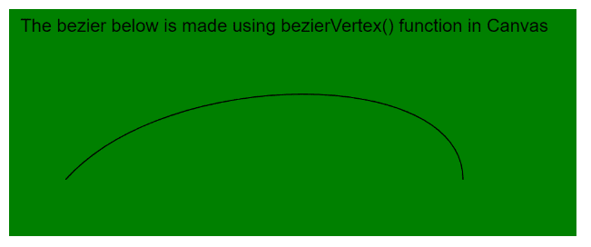
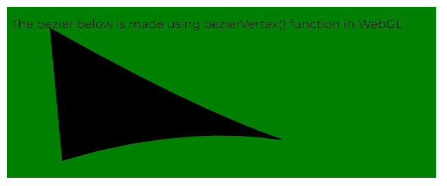

# p5.js | bezierVertex()函数

> 原文:[https://www.geeksforgeeks.org/p5-js-beziervertex-function/](https://www.geeksforgeeks.org/p5-js-beziervertex-function/)

p5.js 中的 **bezierVertex()函数**用于指定绘制贝塞尔曲线的顶点坐标。对该函数的每次调用都定义了贝塞尔曲线的两个控制点和一个锚点的位置。该功能只能在 **beginShape()** 和 **endShape()** 之间使用。第一次用 **beginShape()** 调用时，必须先调用**顶点()**函数来设置第一个锚点。

该函数在 2D 模式下需要 6 个参数，在 3D 模式下需要 9 个参数(包括 z 坐标)。2D 模式和 3D 模式都可以用于在 WebGL 模式下绘图。

**语法:**

```
bezierVertex( x2, y2, x3, y3, x4, y4 )
```

运筹学

```
bezierVertex( x2, y2, z2, x3, y3, z3, x4, y4, z4 )
```

**参数:**该功能接受九个参数，如上所述，描述如下:

*   **x2:** 是指定第一个控制点 x 坐标的数字。
*   **y2:** 是指定第一个控制点 y 坐标的数字。
*   **x3:** 是指定第二个控制点 x 坐标的数字。
*   **y3:** 是指定第二个控制点 y 坐标的数字。
*   **x4:** 是指定锚点 x 坐标的数字。
*   **y4:** 是指定锚点 y 坐标的数字。
*   **z2:** 是指定第一个控制点 z 坐标的数字。它用于 WebGL 模式。
*   **z3:** 是指定第二个控制点 z 坐标的数字。它用于 WebGL 模式。
*   **z4:** 是指定锚点 z 坐标的数字。它用于 WebGL 模式。

下面的例子说明了 p5.js 中的 **bezierVertex()函数**:

**例 1:**

```
function setup() {
  createCanvas(500, 200);
  textSize(16);
}

function draw() {
  background("green");
  fill("black");
  text("The bezier below is made using bezierVertex() function in Canvas", 10, 20);

  // Define the points
  // First Anchor Point
  let p1 = { x: 50, y: 150 };

  // First Control Point
  let p2 = { x: 140, y: 50 };

  // Second Control Point
  let p3 = { x: 400, y: 50 };

  // Anchor Point
  let p4 = { x: 400, y: 150 };

  noFill();

  // Start the bezier
  beginShape();

  // Specify the first anchor point
  vertex(p1.x, p1.y);

  // Specify the other points for bezierVertex()
  bezierVertex(p2.x, p2.y, p3.x, p3.y, p4.x, p4.y);
  endShape();
}
```

**输出:**



**例 2:**

```
let newFont;

function preload() {
  newFont = loadFont("fonts/Montserrat.otf");
}

function setup() {
  createCanvas(500, 200, WEBGL);
  textFont(newFont, 14);
}

function draw() {
  background("green");
  fill("black");
  text("The bezier below is made using bezierVertex() function in WebGL", -245, -75);

  // Define the points
  // First Anchor Point
  let p1 = { x: -200, y: -75, z: 0 };

  // First Control Point
  let p2 = { x: 200, y: 150, z: 10 };

  // Second Control Point
  let p3 = { x: 100, y: -10, z: 10 };

  // Anchor Point
  let p4 = { x: -175, y: 75, z: 10 };

  noFill();

  // Start the bezier
  beginShape();

  // Specify the first anchor point
  vertex(p1.x, p1.y, p1.z);

  // Specify the other points for bezierVertex()
  bezierVertex(p2.x, p2.y, p2.z, p3.x, p3.y, p3.z, p4.x, p4.y, p4.z);
  endShape();
}
```

**输出:**



**在线编辑:**[https://editor.p5js.org/](https://editor.p5js.org/)

**环境设置:**

**参考:**T2】https://p5js.org/reference/#/p5/bezierVertex