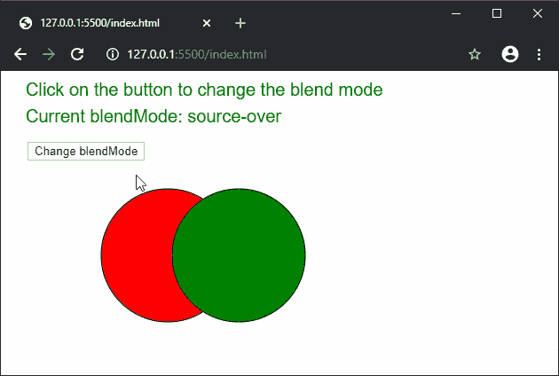

# p5.js | blendMode()函数

> 原文:[https://www.geeksforgeeks.org/p5-js-blendmode-function/](https://www.geeksforgeeks.org/p5-js-blendmode-function/)

**混合模式()功能**用于根据给定的混合模式混合两个像素。不同类型的混合模式有不同的方法将源像素与显示窗口中的像素混合，以产生结果像素。

**语法:**

```
blendMode( mode )
```

**参数:**该功能接受用于混合像素的单参数**模式**。它可以具有以下值:

*   **BLEND:** 它使用颜色的线性插值来混合像素。这是默认的混合模式。
*   **添加:**它通过添加两个像素的颜色来产生新的颜色。
*   **最暗:**它只使用两个像素中较暗的颜色。
*   **最轻:**它只使用两个像素中较浅的颜色。
*   **差异:**它从底层图像中减去颜色。
*   **排除:**与“差”属性效果相似，强度较小。
*   **乘法:**它将两种颜色相乘，得到更暗的图像。
*   **SCREEN:** 它具有与“乘法”效果相反的效果，并使用颜色的反数值。
*   **REPLACE:** 它完全用另一个的像素替换第一个的像素，同时忽略 alpha 值。
*   **REMOVE:** 它使用 alpha 强度从第二种颜色中移除像素。
*   **OVERLAY:** 是“乘”和“屏”模式的混合。它将光照值相乘，并屏蔽黑暗值。它只在 2D 渲染器中工作。
*   **HARD_LIGHT:** 当灰度值在 50%以上时应用“屏”效果，当灰度值较低时应用“乘”效果。它只在 2D 渲染器中工作。
*   **SOFT_LIGHT:** 是“最暗”和“最亮”的混合。它的工作方式类似于强度较低的“叠加”模式。它只在 2D 渲染器中工作。
*   **DODGE:** 点亮浅色调，增加对比度，忽略深色调。它只在 2D 渲染器中工作。
*   **BURN:** 点亮暗色调，增加对比度，忽略亮色调。它只在 2D 渲染器中工作。
*   **减法:**它基于两个像素的剩余部分应用最终颜色。它只在 WEBGL 渲染器中工作。

下面的例子说明了 p5.js 中的 **blendMode()函数**:

**示例:**

```
function setup() {
  blendModes = [
    BLEND,
    ADD,
    DARKEST,
    LIGHTEST,
    DIFFERENCE,
    EXCLUSION,
    MULTIPLY,
    OVERLAY,
    HARD_LIGHT,
    SOFT_LIGHT,
    DODGE,
    BURN
  ]

  index = 0;
  currBlendMode = blendModes[index];

  createCanvas(600, 300);
  textSize(20);
}

function draw() {
  clear();
  text('Click on the button to change the blend mode', 20, 20);
  text("Current blendMode: " + currBlendMode, 20, 50);

  btn = createButton("Change blendMode");
  btn.position(30, 80);
  btn.mousePressed(changeBlendMode);

  // Set the blend mode
  blendMode(currBlendMode);

  // Draw the first circle
  fill("red");
  circle(180, 200, 150);

  // Draw the second circle
  fill("green");
  circle(260, 200, 150);
}

function changeBlendMode() {
  if (index < blendModes.length - 1)
    index++;
  else
    index = 0;
  currBlendMode = blendModes[index];
}
```

**输出:**


**在线编辑:**[https://editor.p5js.org/](https://editor.p5js.org/)

**环境设置:**

**参考:**T2】https://p5js.org/reference/#/p5/blendMode