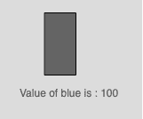

# p5.js | blue()功能

> 原文:[https://www.geeksforgeeks.org/p5-js-blue-function/](https://www.geeksforgeeks.org/p5-js-blue-function/)

p5.js 中的 **blue()函数**用于从颜色或像素数组中提取蓝色值。

**语法:**

```
blue(c)

```

**参数:**该功能接受存储 p5 的单参数 **c** 。颜色对象、颜色组件或 CSS 颜色。

下面的程序说明了 p5.js 中的 blue()函数:

**示例 1:** 本示例使用 blue()函数从颜色中提取蓝色值。

```
function setup() {

    // Create Canvas of size 300*80
    createCanvas(300, 80);
}

function draw() {

    // Set the background color
    background(220);

    // Initialize the parameter
    let c = color(0, 126, 255, 102);

    // Extract the blue value
    let y = blue(c);

    // Set the font size
    textSize(16);

    // Set the font color
    fill(color('red'));

    // Display result
    text("Blue Value is : " + y, 50, 30);
}
```

**输出:**


**示例 2:** 本示例使用 blue()函数提取蓝色值，并将其填充为灰度整数值。

```
function setup() {

    // Create Canvas of size 300*80
    createCanvas(160, 180);
}

function draw() {

    // Set background color    
    background(220);

    // Initialize the color
    let c = color(0, 126, 100, 34);

    // Use blue() function
    let value = blue(c);

    // Fill the color
    fill(value);

    // Create rectangle
    rect(50, 15, 35, 70);

    // Display result
    text("Value of blue is : " + value, 22, 110);
}
```

**输出:**


**参考:**T2】https://p5js.org/reference/#/p5/blue