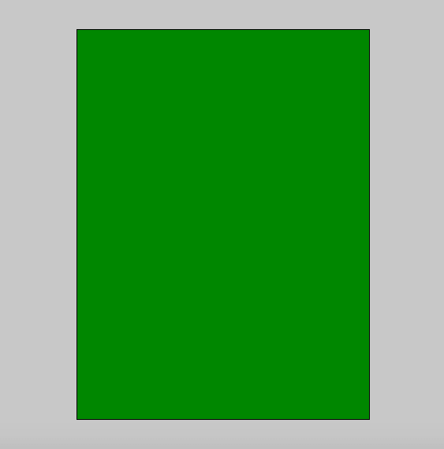
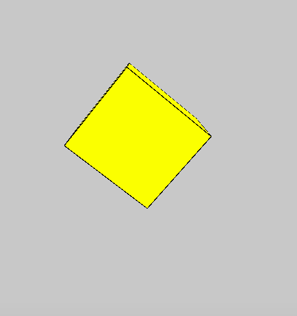

# p5.js | box()功能

> 原文:[https://www.geeksforgeeks.org/p5-js-box-function/](https://www.geeksforgeeks.org/p5-js-box-function/)

p5.js 中的 **box()函数**用于绘制给定高度、宽度和深度的方框。

**语法:**

```
box( width, height, depth, detailX, detailY )
```

**参数:**该功能接受五个参数，如上所述，描述如下:

*   **宽度:**此参数存储盒子的宽度。*   **高度:**此参数存储箱子的高度。*   **深度:**此参数存储盒子的深度。*   **detailX:** 此参数存储 x 维中可选的三角形细分数。*   **detailY:** This parameter stores the optional number of triangle subdivisions in y-dimension.

    以下程序说明了 p5.js 中的**框()**功能:

    **示例 1:** 本示例使用 box()函数绘制一个方框。

    ```
    function setup() {

        // Create Canvas of size 600*600
        createCanvas(600, 600, WEBGL);
    }

    function draw() {

        // Set background color
        background(200);

        // Set fill color of box
        fill('green');

        // box() function
        box(300, 400, 200);
    }
    ```

    **输出:**
    

    **示例 2:** 本示例使用 box()函数绘制一个方框。

    ```
    function setup() {

        // Create Canvas of size 600*600
        createCanvas(600, 600, WEBGL);
    }

    function draw() {

        // Set background color
        background(200);

        // Set fill color of box
        fill('yellow');

        // Rotate 
        rotateX(frameCount * 0.01);
        rotate(frameCount*0.03);

        // box() function called
        box(140, 130, 120);
    }
    ```

    **输出:**
    
    **参考:**[https://p5js.org/reference/#/p5/box](https://p5js.org/reference/#/p5/box)