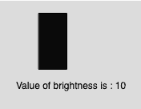

# p5.js |亮度()功能

> 原文:[https://www.geeksforgeeks.org/p5-js-brightness-function/](https://www.geeksforgeeks.org/p5-js-brightness-function/)

p5.js 中的**亮度()函数**用于从颜色或像素阵列中提取 HSB 亮度值。

**语法:**

```
brightness(c)
```

**参数:**该功能接受存储 p5 的单参数 **c** 。颜色对象、颜色组件或 CSS 颜色。

下面的程序说明了 p5.js 中的亮度()函数:

**示例 1:** 本示例使用亮度()函数从颜色或像素阵列中提取 HSB 亮度值。

```
function setup() {

    // Create Canvas of size 300*80
    createCanvas(300, 80);
}

function draw() {

    // Set background color
    background(220);

    // Initialize color mode to HSB
    colorMode(HSB, 255);

    // Initialize the parameter
    let c = color(0, 126, 100);

    // Sets 'value' to 100
    let value = brightness(c); 

    // Set the font size
    textSize(16);

    // Set the font color
    fill(color('red'));

    // Display result
    text("Brightness Value is : " + value, 50, 30);
}
```

**输出:**


**例 2:** 本例使用亮度()函数提取 HSB 亮度值，填充为灰度整数值。

```
function setup() {

    // Create Canvas of size 300*180
    createCanvas(300, 180);
}

function draw() {

    // Set background color
    background(220);

    // Initialize color mode to HSB
    colorMode(HSB, 255);

    // Initialize the parameter
    let c = color(0, 126, 100);

    // Sets 'value' to 100
    let value = brightness(c); 

    // Fill the color 
    fill(value);

    // Create rectangle
    rect(50, 15, 35, 70);

    // Display result
    text("Value of brightness is : " + value, 22, 110);
}
```

**输出:**


**参考:**T2】https://p5js.org/reference/#/p5/brightness