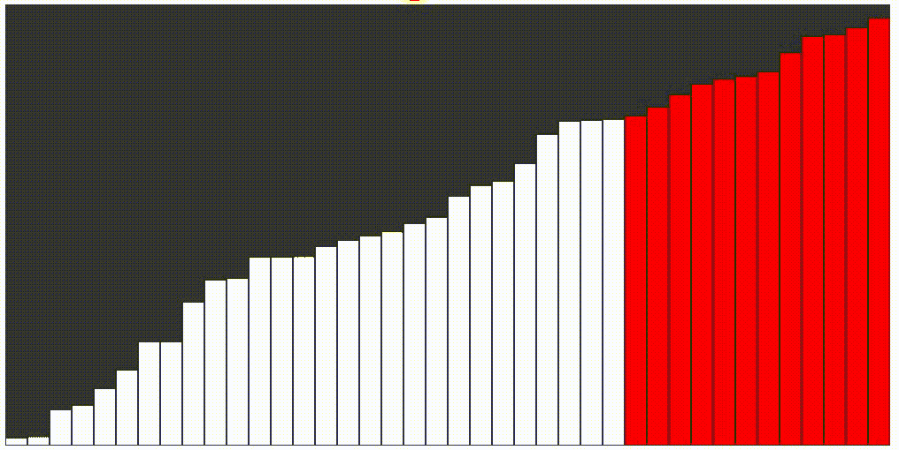

# p5.js |冒泡排序

> 原文:[https://www.geeksforgeeks.org/p5-js-bubble-sort/](https://www.geeksforgeeks.org/p5-js-bubble-sort/)

冒泡排序是最简单的排序算法，如果相邻元素的顺序错误，可以通过重复交换它们来工作。

为了了解更多。请参考[气泡排序](https://www.geeksforgeeks.org/bubble-sort/)

**进场:**

*   创建一个随机值的数组，并根据高度呈现与该值相对应的条。
*   创建一个冒泡排序函数，比较相邻的条形，以便交换条形。
*   为了获得更好的可视化效果，请将颜色设置为当前正在处理的条(在下面显示的示例中为红色)。

**示例:**

```
<!DOCTYPE html>
<html>

<head>
    <title>Bubble Sort</title>

    <meta charset="UTF-8">

    <script src=
"https://cdnjs.cloudflare.com/ajax/libs/p5.js/0.8.0/p5.min.js"
    type="text/javascript"></script>

    <style> 
        body {
            padding: 0;

        }
        canvas {
            vertical-align: top;
        } 
    </style>
</head> 

<body>
    <script type="text/javascript">

        // Set Global Variables 
        let values = [];
        let w = 20;

        // To store the state of each bar
        // in order to change the color
        let states = [];

        function setup() {

            // Create Canvas of Size Windows
            // Width * Windows Height
            createCanvas(800, 400);

            // Insert Random values in array
            values = new Array(floor(width/w));

            for(let i = 0; i < values.length; i++) {
                values[i] = float(random(height));
                states[i] = -1; 
            }

            // Print Unsorted Array
            print("Unsorted Array:" + values);

            // Call to bubble sort function
            bubbleSort(values, 0, values.length);

            // Print Sorted Array
            print("Sorted Array:" + values);

        }

        // Definition of bubble sort
        async function bubbleSort(arr, start, end) {
            if(start >= end) {
                return;
            }

            for(var i = 0; i < end-1; i++) {
                for(var j = 0; j < end-i-1; j++) {
                    if(arr[j] >= arr[j+1]) {
                        states[j] = 1;

                        // Call to swap function
                        await swap(arr, j, j+1);
                        states[j+1] = 0;
                    }
                    states[j] = 2;
                }
            }
            return arr;
        }

        // Definition of draw function
        function draw() {
            background(51);

            for(let i = 0; i < values.length; i++) {
                stroke(0);
                fill(255);

                if(states[i] == 0) {
                    fill(255, 0, 0);
                }
                else if (states[i] == 1) {

                    // Element currently sorting
                    fill("#58FA82");
                }
                else {
                    fill(255);
                }
                rect(i*w, height - values[i], w, values[i]);
            }
        }

        // Definition of swap function
        async function swap(arr, a, b) {

            await sleep(20);
            let t = arr[a];
            arr[a] = arr[b];
            arr[b] = t;
        }

        // Definition of sleep function
        function sleep(ms) {
            return new Promise(resolve => setTimeout(resolve, ms));
        }
    </script>
</body>

</html>            
```

**输出:**
