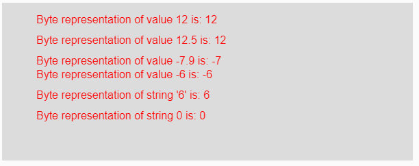
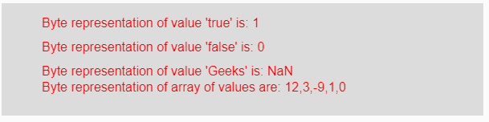

# p5.js | byte()函数

> 原文:[https://www.geeksforgeeks.org/p5-js-byte-function/](https://www.geeksforgeeks.org/p5-js-byte-function/)

p5.js 中的 **byte()函数**用于将给定的数字、数值或布尔值字符串转换为其字节表示形式。该字节数只能是介于 **-128** 到 **127** 之间的整数。该范围之外的值被转换为其相应的字节表示形式。
**语法:**

```
byte(Value)
```

**参数:**该函数接受单个参数**值**，该值将被转换为其字节表示。该值可以是整数、浮点、字符串、布尔值、负值或正值以及值数组。
**返回值:**返回转换后的字节表示。
下面的程序说明了 p5.js:
**中的 byte()函数示例 1:** 本示例使用 byte()函数将输入元素转换为其字节表示。

## java 描述语言

```
function setup() {

    // Creating Canvas size
    createCanvas(600, 230);
}

function draw() {

    // Set the background color
    background(220);

    // Initializing some values
    let Value1 = 12;
    let Value2 = 12.5;
    let Value3 = -7.9;
    let Value4 = -6;
    let Value5 = "6";
    let Value6 = 0;

    // Calling to byte() function.
    let A = byte(Value1);
    let B = byte(Value2);
    let C = byte(Value3);
    let D = byte(Value4);
    let E = byte(Value5);
    let F = byte(Value6);

    // Set the size of text
    textSize(16);

    // Set the text color
    fill(color('red'));

    // Getting byte representation
    text("Byte representation of value 12 is: " + A, 50, 30);
    text("Byte representation of value 12.5 is: " + B, 50, 60);
    text("Byte representation of value -7.9 is: " + C, 50, 90);
    text("Byte representation of value -6 is: " + D, 50, 110);
    text("Byte representation of string '6' is: " + E, 50, 140);
    text("Byte representation of string 0 is: " + F, 50, 170);
}
```

**输出:**



**示例 2:** 本示例使用 byte()函数将输入元素转换为其字节表示。

## java 描述语言

```
function setup() {

    // Creating Canvas size
    createCanvas(600, 140);
}

function draw() {

    // Set the background color
    background(220);

    // Initializing some values
    let Value1 = true;
    let Value2 = false;
    let Value3 = "Geeks";
    let Value4 = [12, 3.6, -9.8, true, false];

    // Calling to byte() function.
    let A = byte(Value1);
    let B = byte(Value2);
    let C = byte(Value3);
    let D = byte(Value4);

    // Set the size of text
    textSize(16);

    // Set the text color
    fill(color('red'));

    // Getting byte representation
    text("Byte representation of value 'true' is: " + A, 50, 30);
    text("Byte representation of value 'false' is: " + B, 50, 60);
    text("Byte representation of value 'Geeks' is: " + C, 50, 90);
    text("Byte representation of array of values are: " + D, 50, 110);
}   
```

**输出:**



**注意:**从上面的例子来看，如果参数是任何小数值，那么它的输出将是它的整数等价物，即它的范围和字符串之间的整数应该是数字，否则它给出输出 NaN，即不是数字。
T3【参考:T5【https://p5js.org/reference/#/p5/byte】T6