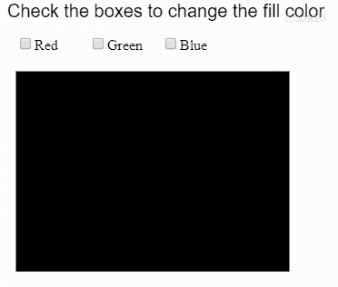
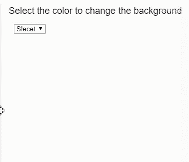

# p5.js | changed()函数

> 原文:[https://www.geeksforgeeks.org/p5-js-changed-function/](https://www.geeksforgeeks.org/p5-js-changed-function/)

每当元素的值发生变化时， **changed()** 函数就会被触发。它可以用来检测复选框元素或选择元素的变化。它还可以用于将事件侦听器附加到元素。

**语法:**

```
changed(fxn)
```

**参数:**该函数接受一个参数，如上所述，如下所述。

*   **fxn:** 这是一个回调函数，每当检测到变化时都会调用。它可以被传递为“假”，这将阻止先前的触发功能停止触发。

下面的例子说明了 p5.js 中的**变()函数**:

**示例 1:** 检测复选框元素的变化

```
let red = 0;
let green = 0;
let blue = 0;

function setup() {
  createCanvas(600, 300);

  // create input boxes
  redCheckbox = createCheckbox('Red', false);
  redCheckbox.position(20, 40)
  redCheckbox.changed(redChanged);

  greenCheckbox = createCheckbox('Green', false);
  greenCheckbox.position(100, 40)
  greenCheckbox.changed(greenChanged);

  blueCheckbox = createCheckbox('Blue', false);
  blueCheckbox.position(180, 40)
  blueCheckbox.changed(blueChanged);
}

function draw() {
  clear()

  // change the fill color based
  // on current rgb the values
  fill(red, green, blue);
  rect(20, 80, 300, 300);

  textSize(20);
  text("Check the boxes to change the fill color", 10, 20);
}

// functions for each of the colors
function redChanged() {
  if (this.checked())
    red = 128;
  else
    red = 0;
}

function greenChanged() {
  if (this.checked())
    green = 128;
  else
    green = 0;
}

function blueChanged() {
  if (this.checked())
    blue = 128;
  else
    blue = 0;
}
```

**输出:**


**示例 2:** 检测选定元素的变化

```
let red = 0;
let green = 0;
let blue = 0;

function setup() {
  createCanvas(350, 300);

  textSize(18)
  text("Select the color to change the background color", 10, 20);

  // create select element
  selectElem = createSelect();
  selectElem.position(20, 40);
  selectElem.option('Slecet');
  selectElem.option('Red');
  selectElem.option('Green');
  selectElem.option('Blue');
  selectElem.changed(changeColor);
}

function changeColor() {
  clear();
  colorVal = this.value();

  if (colorVal == "Red") {
    background("red");
  }
  else if (colorVal == "Green") {
    background("green");
  }
  else if (colorVal == "Blue") {
    background("blue");
  }
  else
    background(128);

  text("Select the color to change the background color", 10, 20);
}
```

**输出:**


**在线编辑:**[【https://editor.p5js.org/】](https://editor.p5js.org/)
**环境设置:**[https://www . geeksforgeeks . org/P5-js-soundfile-object-installation-and-methods/](https://www.geeksforgeeks.org/p5-js-soundfile-object-installation-and-methods/)

**参考:**T2】https://p5js.org/reference/#/p5/changed