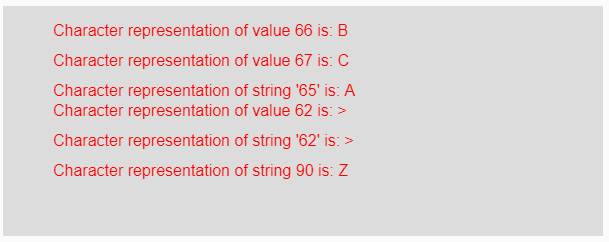
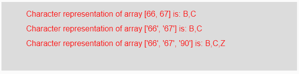

# p5.js | char()功能

> 原文:[https://www.geeksforgeeks.org/p5-js-char-function/](https://www.geeksforgeeks.org/p5-js-char-function/)

p5.js 中的 **char()函数**用于将给定的字符串或数值转换为其对应的单字符串表示形式。如果输入参数是一个字符串值，那么首先它在内部被转换成它的整数等价物，然后它的单个字符串被表示为输出，当字符串或数字的数组被作为参数时，它为数组的每个元素给出单个单个字符串的输出。

**语法:**

```
char( value )
```

**参数:**该函数接受单参数**值**，该值将被转换为其单字符串表示。该值可能是一个数字、一串数字以及一个字符串或数字数组。

**返回值:**返回转换后的单字符串表示形式。

下面的程序说明了 p5.js 中的 char()函数:

**示例 1:** 本示例使用 char()函数将输入值转换为其对应的字符。

```
function setup() { 

    // Creating Canvas size
    createCanvas(600, 230); 
} 

function draw() { 

    // Set the background color 
    background(220); 

    // Initializing some values
    let Value1 = 66;
    let Value2 = 67;
    let Value3 = "65";
    let Value4 = 62; 
    let Value5 = "62";
    let Value6 = 90;

    // Calling to char() function.
    let A = char(Value1);
    let B = char(Value2);
    let C = char(Value3);
    let D = char(Value4);
    let E = char(Value5);
    let F = char(Value6);

    // Set the size of text 
    textSize(16); 

    // Set the text color 
    fill(color('red')); 

    // Getting character representation
    text("Character representation of value 66 is: " + A, 50, 30);
    text("Character representation of value 67 is: " + B, 50, 60);
    text("Character representation of string '65' is: " + C, 50, 90);
    text("Character representation of value 62 is: " + D, 50, 110);
    text("Character representation of string '62' is: " + E, 50, 140);
    text("Character representation of value 90 is: " + F, 50, 170);
} 
```

**输出:**


**示例 2:** 本示例使用 char()函数将输入值转换为其对应的字符。

```
function setup() { 

    // Creating Canvas size
    createCanvas(600, 140); 
} 

function draw() { 

    // Set the background color 
    background(220); 

    // Initializing some values
    let Value1 = [66, 67];
    let Value2 = ["66", "67"];
    let Value3 = ["66", "67", "90"]

    // Calling to char() function.
    let A = char(Value1);
    let B = char(Value2);
    let C = char(Value3);

    // Set the size of text 
    textSize(16); 

    // Set the text color 
    fill(color('red')); 

    // Getting character representation
    text("Character representation of array [66, 67] is: " + A, 50, 30);
    text("Character representation of array ['66', '67'] is: " + B, 50, 60);
    text("Character representation of array ['66', '67', '90'] is: " + C, 50, 90);
}     
```

**输出:**


**参考:**T2】https://p5js.org/reference/#/p5/char