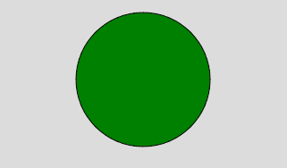
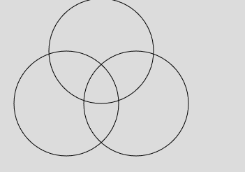

# p5.js | circle()函数

> 原文:[https://www.geeksforgeeks.org/p5-js-circle-function/](https://www.geeksforgeeks.org/p5-js-circle-function/)

**圆()功能**用于在屏幕上画圆。圆形是封闭的形状。可以通过使用圆的中心和半径来创建圆。

**语法:**

```
circle(x, y, d)
```

**参数:**

*   **x:** 用于设置圆心的 x 坐标。
*   **y:** 用于设置圆心的 y 坐标。
*   **d:** 用于设置圆的直径。

**例 1:**

```
function setup() { 

    // Create Canvas of given size 
    createCanvas(400, 300); 

} 

function draw() { 

    background(220);

    // Use color() function
    let c = color('green');

    // Use fill() function to fill color
    fill(c);

    // Draw a circle 
    circle(200, 100, 150); 

}
```

**输出:**


**例 2:**

```
function setup() { 

    // Create Canvas of given size 
    createCanvas(400, 300); 

} 

function draw() { 

    background(220);

    // Draw a circle 
    circle(200, 150, 150); 

    noFill();

    // Draw a circle 
    circle(100, 150, 150); 

    // Draw a circle 
    circle(150, 75, 150);

}
```

**输出:**


**参考:**T2】https://p5js.org/reference/#/p5/circle