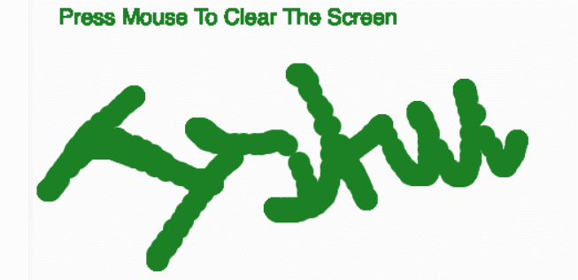
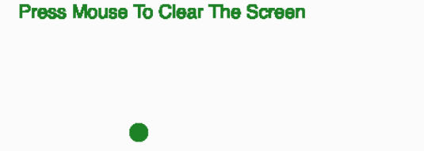

# p5.js | clear()功能

> 原文:[https://www.geeksforgeeks.org/p5-js-clear-function/](https://www.geeksforgeeks.org/p5-js-clear-function/)

p5.js 中的 **clear()函数**用于清除缓冲区内的像素。此功能仅清除画布。该函数清除所有内容，使所有像素 100%透明。它可以用来重置绘图画布。

**语法:**

```
clear()
```

**参数:**此功能不接受任何参数。

下面的程序说明了 p5.js 中的 clear()函数:

**示例:**本示例使用 clear()函数清除画布。

```
function setup() {

    // Create canvas 
    createCanvas(700, 700);
}

function draw() {

    noStroke();

    // Draw Ellipse at mouseX and mouseY
    ellipse(mouseX, mouseY, 20, 20);

    // Set color of the ellipse
    fill('green');

    // Set the text size
    textSize(20);

    // Set the text
    text("Press Mouse To Clear The Screen", 20, 30);
}

// Define the mousePressed function
function mousePressed() {
    clear();
}
```

**输出:**
**点击鼠标按钮前:**

**点击鼠标按钮后:**


**参考:**T2】https://p5js.org/reference/#/p5/clear