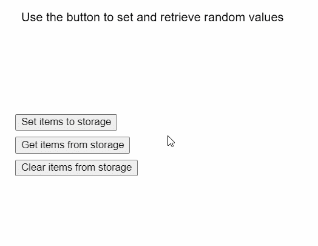

# p5.js | clearStorage()函数

> 原文:[https://www.geeksforgeeks.org/p5-js-clearstorage-function/](https://www.geeksforgeeks.org/p5-js-clearstorage-function/)

p5.js 中的**清除存储()功能**用于使用**存储项目()**功能清除本地存储集中的所有项目。当前域的项目将被删除。尝试使用 **getItem()** 函数检索任何项目将返回空值。它不接受任何参数。

**语法:**

```
clearStorage()
```

**参数:**此功能不接受参数。

下面的程序说明了 p5.js 中的 **clearStorage()** 功能:

**示例:**

```
function setup() {
  createCanvas(400, 300);
  textSize(16);
  text("Use the button to set and"+
       " retrieve random values", 20, 20);

  setBtn = createButton("Set items to storage");
  setBtn.position(20, 150);
  setBtn.mouseClicked(setItems);

  getBtn = createButton("Get items from storage");
  getBtn.position(20, 180);
  getBtn.mouseClicked(getItems);

  clearBtn = createButton("Clear items from storage");
  clearBtn.position(20, 210);
  clearBtn.mouseClicked(clearItems);
}

function clearItems() {
  clear();
  text("Use the button to set and retrieve"+
       " random values", 20, 20);
  text("Storage Cleared!", 20, 40);

  // Clear all items in storage
  clearStorage();
}

function getItems() {
  clear();
  text("Use the button to set and retrieve"+ 
       " random values", 20, 20);

  // Retrieve values from local storage
  id = getItem("savedNumber");
  author = getItem("savedString");
  isBestseller = getItem("savedBoolean");

  // Display the values
  text("The retrieved items are:", 20, 40);
  text("Book ID: " + id, 20, 60);
  text("Author: " + author, 20, 80);
  text("Bestseller: " + isBestseller, 20, 100);
}

function setItems() {
  clear();
  text("Use the button to set and retrieve"+
       " random values", 20, 20);
  text("Random items set!", 20, 40);

  // Generate random values
  randomID = floor(random(100));
  randomAuthor = "Author " + randomID;
  randomBool = randomID > 50 ? true : false;

  // Store values to local storage
  storeItem("savedNumber", randomID);
  storeItem("savedString", randomAuthor);
  storeItem("savedBoolean", randomBool);
}
```

**输出:**



**参考:**T2】https://p5js.org/reference/#/p5/clearStorage

**在线编辑:**[https://editor.p5js.org/](https://editor.p5js.org/)

**环境设置:**

**参考:**T2】https://p5js.org/reference/#/p5/rectMode