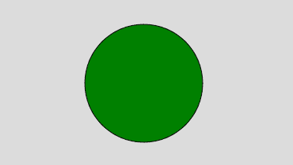
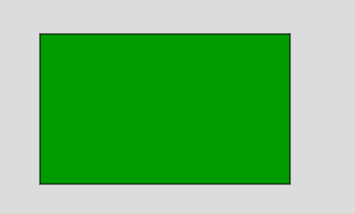

# p5.js | color()功能

> 原文:[https://www.geeksforgeeks.org/p5-js-color-function/](https://www.geeksforgeeks.org/p5-js-color-function/)

**color()函数**用于创建颜色并将其存储到变量中。颜色函数的参数是 RGB 或 HSB 值，具体取决于当前的 colorMode()函数。**颜色()**功能的默认模式是从 0 到 255 的 RGB 值。因此，函数**颜色(255，204，0)** 将返回亮黄色。

**语法:**

```
color(gray, alpha)
color(v1, v2, v3, alpha)
color(value)
color(values)
color(color)

```

**参数:**

*   **灰色:**用于设置白色和黑色之间的灰度值。
*   **alpha:** 用于设置图形的透明度。
*   **v1:** 用于设置相对于当前颜色范围的红色或色相值。
*   **v2:** 用于设置相对于当前颜色范围的绿色或饱和度值。
*   **v3:** 用于设置相对于当前颜色范围的蓝色或亮度值。
*   **值:**用于设置颜色串的值。
*   **值:**是包含红、绿、蓝、阿尔法值的数组。
*   **颜色:**用于设置笔画颜色。

**返回值:**返回结果颜色值。

**例 1:**

```
function setup() { 

    // Create Canvas of given size 
    createCanvas(400, 300); 

} 

function draw() { 

    background(220);

    // Use color() function
    let c = color('green');

    // Use fill() function to fill color
    fill(c);

    // Draw a circle 
    circle(200, 150, 150); 

} 
```

**输出:**


**例 2:**

```
function setup() { 

    // Create Canvas of given size 
    createCanvas(400, 300); 
} 

function draw() { 

    // Set the background color 
    background(220); 

    // Use color() function
    let c = color(0, 155, 0);

    // Use fill() function to fill color
    fill(c)

    // Draw a line 
    rect(50, 50, 250, 150); 

} 
```

**输出:**


**参考:**T2】https://p5js.org/reference/#/p5/color