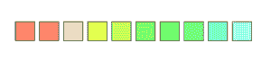
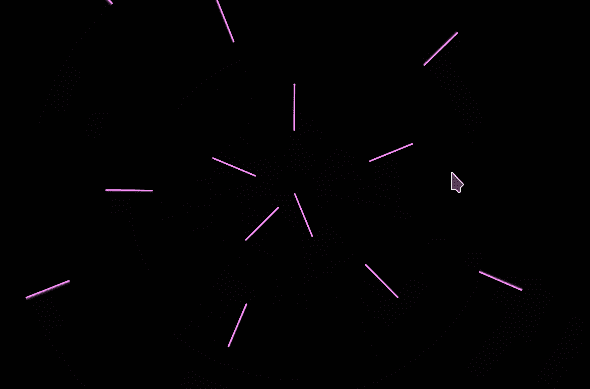

# p5.js colorMode()功能

> 原文:[https://www.geeksforgeeks.org/p5-js-colormode-function/](https://www.geeksforgeeks.org/p5-js-colormode-function/)

**颜色模式()功能**是 **p5.js** 中的内置功能，用于让用户在 RGB 或 HSB 颜色选项之间进行选择。默认情况下， **RGB** 颜色模式。因此，用户输入的参数对应于**红色、** **绿色**和**蓝色**值。用户通过传入这些值的数字(介于 0 到 255 之间的参数)来创建各种颜色，因此，生成的颜色是红色、绿色和蓝色的混合。还有一种称为 **HSB** 的颜色模式，使用**色相、** **饱和度**和**亮度**值来定义颜色。

**语法:**

```
colorMode(mode, [value])
colorMode(mode, value1, value2, value3, [valueA])
```

**参数:**

*   **模式:**是必须下注的颜色的模式。这可以设置为 RGB 或 HSB。它相当于红色/绿色/蓝色或色调/饱和度/亮度。
*   **值:**表示 0 到 255 之间所有值的范围。它是一个可选值。
*   **值 1:** 是表示红色或色调值范围的数字。
*   **值 2:** 是一个数字，表示绿色或饱和度值的范围，取决于当前的颜色模式。
*   **值 3:** 是一个数字，表示蓝色或亮度/明度值的范围，取决于当前颜色模式
*   **值 A:** 是表示α值范围的数字，介于 0 和 255 之间。它是一个可选值。

下面的程序说明了 p5.js 中的 **colorMode()函数**:

**例 1:**

## java 描述语言

```
function setup() { 
    createCanvas(600, 600);
    colorMode(HSB, 360, 100, 100);
    noLoop();
}

function draw() { 
    background(0, 0, 100);

    for (var i = 0; i < 10; i = i + 1) {
        var x = 50 + i * 50;
        var y = 300;
        var h = i * 20;
        var s = random(20, 80);
        fill(h, s, 100);
        rect (x, y, 40, 40);
    }
}
```

**输出:**



**例 2:**

## java 描述语言

```
function setup() {
    createCanvas(600, 400);
    background(0);
    colorMode(RGB, 78);
}

function draw() {
    fill(0, 0, 0, 10);
    rect(-1, -1, 1401, 901);
    stroke(2 * frameCount, mouseX/10, 255);
    translate(width/2, height/2);
    for (let i = 2; i < 400; i = i+20) {
        rotate(
            noise(frameCount * 0.0004) * (1000/mouseX)
        );
        line(i, 0, ((mouseX/10) + i), 0);
    }
}
```

**输出:**



**参考:**T2**https://p5js.org/reference/#/p5/colorMode**T5】