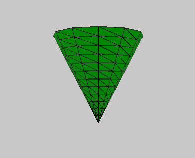
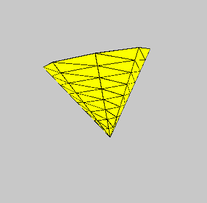

# p5.js | cone()功能

> 原文:[https://www.geeksforgeeks.org/p5-js-cone-function/](https://www.geeksforgeeks.org/p5-js-cone-function/)

p5.js 中的**圆锥体()功能**用于绘制给定半径和高度的圆锥体。

**语法:**

```
cone( radius, height, detailX, detailY, cap )
```

**参数:**该函数接受五个参数，如上所述，如下所述:

*   **半径:**此参数存储圆锥体的半径。*   **高度:**此参数存储圆锥体的高度。*   **detailX:** 此参数存储 x 维中的线段数。*   **detailY:** 此参数存储 y 维的线段数。*   **cap:** This parameter stores the boolean value whether to draw base of the cone.

    下面的程序说明了 p5.js 中的 cone()函数:

    **示例 1:** 本示例使用 cone()函数绘制给定半径和高度的圆锥体。

    ```
    function setup() {

        // Create Canvas of size 600*600
        createCanvas(600, 600, WEBGL);
    }

    function draw() {

        // Set background color
        background(200);

        // Set fill color of cone
        fill('green');

        // Call to cone function
        cone(90, 175, 12, 12, true);
    }
    ```

    **输出:**
    

    **示例 2:** 本示例使用 cone()函数绘制给定半径和高度的圆锥体。

    ```
    function setup() {

        // Create Canvas of size 600*600
        createCanvas(600, 600, WEBGL);
    }

    function draw() {

        // Set background color
        background(200);

        // Set fill color of cone
        fill('yellow');

        // Rotate 
        rotateX(frameCount * 0.01);
        rotate(frameCount*0.03);

        // Call to cone function
        cone(90, 135, 8, 8, true);
    }
    ```

    **输出:**
    
    **参考:**[https://p5js.org/reference/#/p5/cone](https://p5js.org/reference/#/p5/cone)