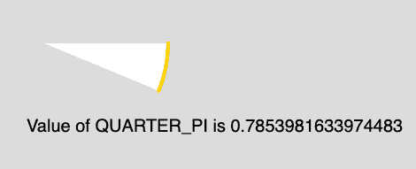

# p5.js |常量| QUARTER_PI

> 原文:[https://www.geeksforgeeks.org/p5-js-constants-quarter_pi/](https://www.geeksforgeeks.org/p5-js-constants-quarter_pi/)

QUARTER_PI 是一个数学常数，值为 0.7853982。它是圆的周长与直径之比的四分之一。

**语法:**

```
QUARTER_PI
```

下面的程序说明了 p5.js 中的 QUARTER _ PI 常数:

**例:**本例描述了 QUARTER_PI 常数。

```
function setup() {

    // Create Canvas of size 880*300
    createCanvas(880, 300);
}

function draw() {

    // Set the background Color
    background(220);

    // Set the stroke color
    stroke(255, 204, 0);

    // Set the stroke weight
    strokeWeight(4);

    // Use of constant QUARTER_PI
    arc(50, 50, 280, 280, 0, QUARTER_PI/2); 

    noStroke();

    // Set font size
    textSize(20);

    // Display result
    text("Value of QUARTER_PI is " 
            + QUARTER_PI, 30, 150);
}
```

**输出:**


**参考:**T2】https://p5js.org/reference/#/p5/QUARTER_PI