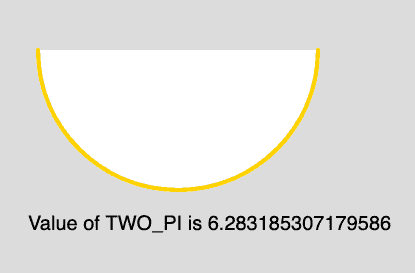

# p5.js |常量| TWO_PI

> 原文:[https://www.geeksforgeeks.org/p5-js-constants-two_pi/](https://www.geeksforgeeks.org/p5-js-constants-two_pi/)

**TWO_PI** 是一个数学常数，取值为 6。58860 . 88888888861 它是圆周长与直径之比的两倍。

**语法:**

```
TWO_PI
```

下面的程序说明了 TWO_PI 在 p5.js 中的用法:

**示例:**

```
function setup() {

    // Create Canvas of size 880*300  
    createCanvas(880, 300);
}

function draw() {

    // Set the Background Color
    background(220);

    // Set the stroke color
    stroke(255, 204, 0);

    // Set the stroke weight
    strokeWeight(4);

    // Draw Arc
    // Use of constant TWO_PI
    arc(180, 50, 280, 280, 0, TWO_PI/2);

    // Unset the stroke
    noStroke();

    // Set the text size
    textSize(20);

    // Display output
    text("Value of TWO_PI is "+ TWO_PI, 30, 230);
}
```

**输出:**


**参考:**T2】https://p5js.org/reference/#/p5/TWO_PI