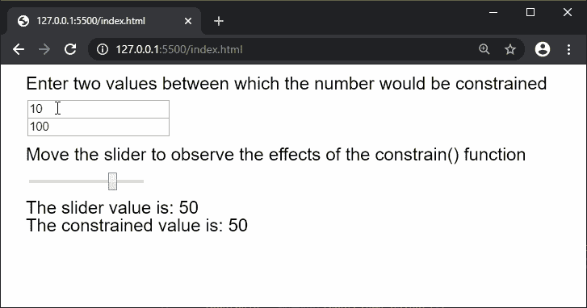
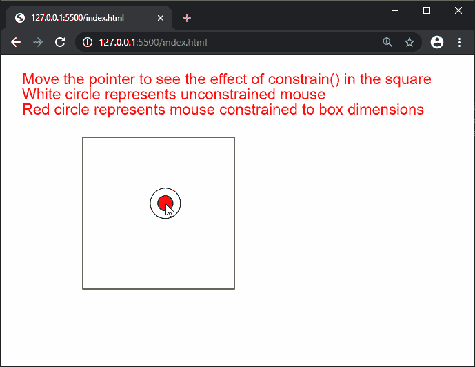

# p5.js |约束()函数

> 原文:[https://www.geeksforgeeks.org/p5-js-constrain-function/](https://www.geeksforgeeks.org/p5-js-constrain-function/)

p5.js 中的**约束()函数**用于将一个数约束在给定的最小值和最大值之间。

**语法:**

```
constrain( n, low, high )
```

**参数:**该函数接受三个参数，如上所述，如下所述:

*   **n:** 是一个数字，表示需要约束的值。
*   **low:** 是一个数字，表示该数字被约束的最小极限。
*   **高:**是一个数字，表示该数字被限制的最大极限。

**返回值:**返回一个带有约束值的数字。

下面的例子说明了 p5.js 中的**约束()函数**:

**例 1:**

```
function setup() {
  createCanvas(650, 200);
  textSize(20);

  inputElemA = createInput(10);
  inputElemA.position(30, 40);

  inputElemB = createInput(100);
  inputElemB.position(30, 60);

  sliderElem = createSlider(-100, 100, 50, 1);
  sliderElem.position(30, 120);
}

function draw() {
  clear();
  text("Enter two values between which the "
    + "number would be constrained", 20, 20);
  text("Move the slider to observe the effects"
    + " of the constrain() function", 20, 100);

  // Convert the string value to a number value
  inputValA = Number(inputElemA.value());
  inputValB = Number(inputElemB.value());
  sliderVal = sliderElem.value();

  text("The slider value is: " + sliderVal, 20, 160);

  // Display the constrained value
  text("The constrained value is: "
        + constrain(sliderVal, inputValA,
        inputValB), 20, 180);
}
```

**输出:**


**例 2:**

```
function setup() {
  createCanvas(600, 350);
  textSize(20);

}

function draw() {
  clear();
  text("Move the pointer to see the effect "
        + "of constrain() in the square", 20, 30);
  text("White circle represents unconstrained"
        + " mouse", 20, 50);
  text("Red circle represents mouse constrained"
        + " to box dimensions", 20, 70);

  noFill();
  square(100, 100, 200);

  circle(mouseX, mouseY, 40);

  // Constrain the mouse x and y position
  constrainedMouseX = constrain(mouseX, 100, 300);
  constrainedMouseY = constrain(mouseY, 100, 300);

  fill('red');
  circle(constrainedMouseX, constrainedMouseY, 20);
}
```

**输出:**


**在线编辑:**[https://editor.p5js.org/](https://editor.p5js.org/)

**环境设置:**

**参考:**T2】https://p5js.org/reference/#/p5/constrain