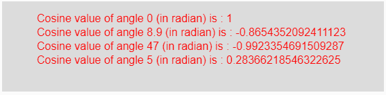

# p5.js | cos()功能

> 原文:[https://www.geeksforgeeks.org/p5-js-cos-function/](https://www.geeksforgeeks.org/p5-js-cos-function/)

p5.js 中的 **cos()函数**用于计算一个角度的余弦值(以弧度为单位)作为函数的输入参数，并返回-1 到 1 之间的结果。

**语法:**

```
cos(angle)
```

**参数:**该函数接受单个参数**角度**，这是一个以弧度为单位的角度，其余弦值需要计算。

**返回值:**返回以弧度为单位的角度的余弦值作为输入参数。

下面的程序说明了 p5.js 中的 cos()函数:

**示例:**本示例使用 cos()函数获取角度的余弦值，单位为弧度。

```
function setup() { 

    // Create Canvas of given size
    createCanvas(550, 130); 
} 

function draw() { 

    // Set the background color 
    background(220); 

    // Initialize the parameter with
    // angles in radian only
    let a = 0; 
    let b = 8.9; 
    let c = 47;
    let d = 5;

    // Call to cos() function 
    let v = cos(a);
    let w = cos(b);
    let x = cos(c);
    let y = cos(d);

    // Set the size of text 
    textSize(16); 

    // Set the text color 
    fill(color('red')); 

    // Getting cosine value 
    text("Cosine value of angle 0 (in radian) is : " + v, 50, 30);
    text("Cosine value of angle 8.9 (in radian) is : " + w, 50, 50);
    text("Cosine value of angle 47 (in radian) is : " + x, 50, 70);
    text("Cosine value of angle 5 (in radian) is : " + y, 50, 90);     
} 
```

**输出:**


**注意:**在上面的代码中，输入角度应以弧度为单位。为了将角度转换为弧度，我们可以使用以下公式:

```
Angles_in_radian = (π/180)*angles_in_degree
```

**参考:**T2】https://p5js.org/reference/#/p5/cos