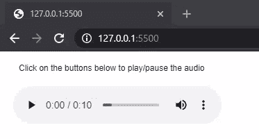

# p5.js | createAudio()函数

> 原文:[https://www.geeksforgeeks.org/p5-js-createaudio-function/](https://www.geeksforgeeks.org/p5-js-createaudio-function/)

**createAudio()** 函数用于在 DOM 中创建一个音频元素。音频被创建为 **p5。MediaElement** ，有控制媒体及其播放的方法。

**语法:**

```
createAudio(src, callback)
```

**参数:**该函数接受两个参数，如上所述，如下所述:

*   **src:** 它是指定音频文件路径的字符串或字符串数组。字符串数组可用于指定多种路径，以支持各种浏览器。
*   **回调:**这是一个回调函数，当‘can playthrough’事件触发时会被触发。当音频完成加载且不需要任何额外缓冲时，将触发此事件。这是一个可选参数。

**返回值:**返回一个指向 **p5 的指针。带音频的 MediaElement** 。

下面的例子说明了 p5.js 中的 **createAudio()函数**:

**例 1:**

```
function setup() {
  createCanvas(300, 300);
  text("Click on the buttons below to"+ 
       "play/pause the audio", 20, 20);

  audioElement = createAudio("sample_audio.wav");
  audioElement.position(20, 50);
  audioElement.size(300);

  // Show the audio controls
  audioElement.showControls();
}
```

**输出:**


**例 2:**

```
function setup() {
  createCanvas(300, 300);
  text("Loading the audio...", 20, 20);

  audioElement = createAudio("sample_audio.mp3", afterLoad);
  audioElement.position(20, 20);
  audioElement.size(300);

  playBtn = createButton("Play Audio");
  playBtn.position(30, 80);
  playBtn.mouseClicked(playAudio);

  pauseBtn = createButton("Pause Audio");
  pauseBtn.position(150, 80);
  pauseBtn.mouseClicked(pauseAudio);
}

function afterLoad() {
  text("The audio has finished loading and"+
              " can now be played!", 20, 40);
}

function playAudio() {
  audioElement.play();
}

function pauseAudio() {
  audioElement.pause();
}
```

**输出:**


**在线编辑:**[https://editor.p5js.org/](https://editor.p5js.org/)

**环境设置:**

**参考:**T2】https://p5js.org/reference/#/p5/createAudio